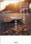
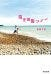

WEB2.0 Bookを買って読んでからというもの、去年会社の近くに引っ越してからなかった読書欲が再燃していた。それではじめは今まで手を出していなかった技術系とかそういうIT系の読み物を読んでいたのだけど、ふと小説が読みたくなった。でも、小説売り場って、なんだか人の死を扱った商品が妙に多い。  
  
とりあえずそういうものを読む気になれない感じだったので、僕が大好きな映画「きょうのできごと」のような群像劇ものを読んでみることにした。かといって、何を読んでいいやら分からなかったので、「きょうのできごと」原作著者柴崎さんの書いたものを読んでみることにした。それが「次の町まできみはどんな歌をうたうの？」と「青空感傷ツアー」だ。

[“次の町まで、きみはどんな歌をうたうの?” :: 柴崎 友香](http://www.amazon.co.jp/exec/obidos/redirect?tag=mrchildrenonl-22%26link_code=xm2%26camp=2025%26creative=165953%26path=http://www.amazon.co.jp/gp/redirect.html%253fASIN=4309407862%2526tag=mrchildrenonl-22%2526lcode=xm2%2526cID=2025%2526ccmID=165953%2526location=/o/ASIN/4309407862%25253FSubscriptionId=02ZH6J1W0649DTNS6002)

[“青空感傷ツアー” :: 柴崎 友香](http://www.amazon.co.jp/exec/obidos/redirect?tag=mrchildrenonl-22%26link_code=xm2%26camp=2025%26creative=165953%26path=http://www.amazon.co.jp/gp/redirect.html%253fASIN=4309407668%2526tag=mrchildrenonl-22%2526lcode=xm2%2526cID=2025%2526ccmID=165953%2526location=/o/ASIN/4309407668%25253FSubscriptionId=02ZH6J1W0649DTNS6002)

なんだろな、どちらも「きょうのできごと」を彷彿とさせるのは確かだ。でも僕が好きなのは、関西弁でリズムよく（小説でリズムってのも変な気がするけど）発せられる言い回しだ。東京弁にはない、人間味がそこにある気がして、いい。「青空感傷ツアー」はあまりにも突拍子もない行動もなんとも言えないのだけど。  
  
まだ僕はそういうものを読む気になれない。かといって、WEB2.0には食傷気味だ。･･･Amazonに推薦してもらうか(笑)

Technorati Tags: [Amazon](http://www.technorati.com/tag/Amazon), [web2.0](http://www.technorati.com/tag/web2.0), [小説](http://www.technorati.com/tag/小説), [柴崎 友香](http://www.technorati.com/tag/柴崎%20友香)