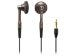

このブログを開始するに当たって、ブログを日記から自分のメディアとして捉え直そうと思った。それと同時に、書き込みが減ってきていた音楽寄りの書き込みも増やそうかと。

で、この間イヤーフォンを買いました。

[“オーディオテクニカ インナーイヤーヘッドホン ATH-CM700 BW” :: オーディオテクニカ](http://www.amazon.co.jp/exec/obidos/redirect?tag=mrchildrenonl-22%26link_code=xm2%26camp=2025%26creative=165953%26path=http://www.amazon.co.jp/gp/redirect.html%253fASIN=B000FWGSAY%2526tag=mrchildrenonl-22%2526lcode=xm2%2526cID=2025%2526ccmID=165953%2526location=/o/ASIN/B000FWGSAY%25253FSubscriptionId=02ZH6J1W0649DTNS6002)

イヤフォンを発売日に買うって言うのは初めてのできごとですが、金曜日に買ってもうだいたいエージングが終わった感じです。もともと、このイヤフォンと同じ価格帯である”ATH-CM7"を使っていたんですが、半端じゃなく音がよくなった感じ。高温高音も低音もはっきりでていて、ドラムの音ってこんなに気持ちよかったんだって感じますよ。  
  
それにしても、ビックリなのは、ここまでの音質を奏でられるiPod nanoとAACの組み合わせ。標準のイヤフォンなんて付けてられない！(封切りもしてないけど)

Technorati Tags: [Apple](http://www.technorati.com/tag/Apple), [Ath-CM700](http://www.technorati.com/tag/Ath-CM700), [audiotechnica](http://www.technorati.com/tag/audiotechnica), [iPod nano](http://www.technorati.com/tag/iPod%20nano), [AAC](http://www.technorati.com/tag/AAC)