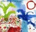

なぜかちょっと気になって買ってみた CD をご紹介。

[“ULTRA BLUE” :: 宇多田ヒカル](http://www.amazon.co.jp/exec/obidos/redirect?tag=mrchildrenonl-22%26link_code=xm2%26camp=2025%26creative=165953%26path=http://www.amazon.co.jp/gp/redirect.html%253fASIN=B000F9UE8E%2526tag=mrchildrenonl-22%2526lcode=xm2%2526cID=2025%2526ccmID=165953%2526location=/o/ASIN/B000F9UE8E%25253FSubscriptionId=02ZH6J1W0649DTNS6002)

で、もうひとつ買ってしまったのが、こちら。

[“ON THE ROCKS!” :: EGO-WRAPPIN’](http://www.amazon.co.jp/exec/obidos/redirect?tag=mrchildrenonl-22%26link_code=xm2%26camp=2025%26creative=165953%26path=http://www.amazon.co.jp/gp/redirect.html%253fASIN=B000F6YUD2%2526tag=mrchildrenonl-22%2526lcode=xm2%2526cID=2025%2526ccmID=165953%2526location=/o/ASIN/B000F6YUD2%25253FSubscriptionId=02ZH6J1W0649DTNS6002)

宇多田さんのアルバムを買ったのは初めて。シングルも買ったことないのだけど、うーん、自分には合わないかもって感じ。EGO-WRAPPIN’はデビューアルバム買って、それ以降あまり聞かなかったのだけど、もともとの音楽性は割と好きな感じなので、結構お気に入りになっちゃいました。僕の根底にある音楽は J-POP なので、あくまでイレギュラーな存在なのかもしれませんが。

来週にはいよいよ箒星。そして、どうやら Salyu さんが久しぶりに地上波に出るというウワサもある”to U”のリリースも控えていて、なんだか未来は明るいって感じです。(それは単純すぎやしないか？)
