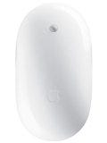

**商品:** [Apple Mighty Mouse Wireless Mighty Mouse MA272J/A](http://www.amazon.co.jp/exec/obidos/ASIN/B000H77RCU/mrchildrenonl-22/ref=nosim/)

**コメント:**   
買うつもりはなかったんだけど、Apple Storeに行ってしまって、突然その場でほしくなってお買い上げ。  
  
よくスペックとか確認しなかったから知らなかったんだけど、ワイヤレスの方はレーザー式になっている。(ワイヤードは光学式)  
  
ちなみに、これはWindowsには対応していない。  
  
  
  
ワイヤードと比べるとちょっと重くなったけど、やっぱり線がないってのは見た目に美しい。macbook用のみにする予定だったけど、自宅メインmacであるmac mini用としてしばらくは活躍するかも。  
  
ちなみに今まで使っていたワイヤードは、緊急避難用としてとっておくことにしました。  
  
  
  
PCもmacも大切なのは入力装置であるキーボードとマウス。自分にあったものを使えているかどうか、ですよね。

**評価:**

**評価者:** へるべすと

**評価日付:** 2006–08–06

**画像(URL):**

**メーカー:** アップルコンピュータ

**ASIN:** B000H77RCU

feedpath tags: [Mighty Mouse](http://feedpath.jp/search/index.csp?search_text=Mighty%20Mouse), [Apple](http://feedpath.jp/search/index.csp?search_text=Apple) generated by [feedpath](http://feedpath.jp)