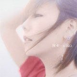

**楽曲/アルバムタイトル:** [彼女](http://www.amazon.co.jp/exec/obidos/ASIN/B000GRUR78/mrchildrenonl-22/ref=nosim/)

**アーティスト:** aiko

**コメント:**   
買いました。先日のBonnie Pinkといい、今までの自分だったら絶対買わなかったようなアルバムを最近買ってます。  
  
渋谷に買いに行って初回限定版がずらっと並んでるとは思わなかったですが、どうやら通常版との違いが調べてみても出てこなかったので、最初の工場出荷分が全部初回版になっているような気もします。たまにそういうの見かけるので。  
  
  
  
aikoはやっぱりaikoだなぁと思ってしまいました。すごくいいアルバムです。aikoさん独特の”地に足がついていない感じ”のメロディラインとか(コードとか勉強してる人だともっとうまく説明できるのかもしれないけど)、そういう彼女のもつ独特の感性から放たれる音楽がすごく心の中に染みてくる感じ。  
  
歌詞の世界は、最近踏み込まずに聞いている自分がいるので分かりません。歌詞カードとか見たりするのが面倒なので。  
  
  
  
よく英国の聞いたことないバンドを買ってきて聞くってことは以前したことあるんですが、やっぱ日本でもいい音楽を放っている人は一杯いるなぁとか思ってしまいます。  
  
  
  
p.s.  
  
このブログの書き込みがインターネットネタが多いので、音楽関連はVOXに移行しようかと思ってましたが、  
  
あっちってログインしないとコメントできないっぽいのでとりあえず延期。

**評価:**

**評価者:** へるべすと

**評価日付:** 2006–08–27

**画像(URL):**

**メディア:** CD

**発売日:** 2006–08–23

**制作会社:** ポニーキャニオン

**ASIN:** B000GRUR78

feedpath tags: [aiko](http://feedpath.jp/search/index.csp?search_text=aiko), [彼女](http://feedpath.jp/search/index.csp?search_text=%E5%BD%BC%E5%A5%B3), [music](http://feedpath.jp/search/index.csp?search_text=music), [album](http://feedpath.jp/search/index.csp?search_text=album) generated by [feedpath](http://feedpath.jp)