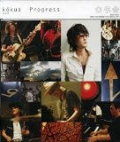

**楽曲 / アルバムタイトル:** [Progress](http://www.amazon.co.jp/exec/obidos/ASIN/B000GEIQN8/mrchildrenonl-22/ref=nosim/)

**アーティスト:** kokua, スガシカオ, 武部聡志, 小倉博和

**コメント:**   
salyuさんが出るからとPOP JAMを見てたら、彼らも出ていた。  
  
たぶんNHKつながりで、なんだろうけど、その音楽をきいて自分の体の中に突き抜けるものを感じたので思わず買ってしまった。  
  
  
  
バンドの息がピッタリなのだ。そして無駄がないのだ。もう、芸術だと思う。  
  
  
  
こんな気持ちになったのは、salyuさんのM-1(仮題、現在はVALON-1)以来だ。

**評価:**

**評価者:** へるべすと

**評価日付:** 2006–09–21

**画像(URL):**

**メディア:** CD

**発売日:** 2006–08–02

**制作会社:** BMG JAPAN

**ASIN:** B000GEIQN8

feedpath tags: [music](http://feedpath.jp/search/index.csp?search_text=music), [スガシカオ](http://feedpath.jp/search/index.csp?search_text=%E3%82%B9%E3%82%AC%E3%82%B7%E3%82%AB%E3%82%AA), [kokua](http://feedpath.jp/search/index.csp?search_text=kokua), [Progress](http://feedpath.jp/search/index.csp?search_text=Progress) generated by [feedpath](http://feedpath.jp)