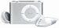

探したことないから分からないけど、あまり見かけないようなので書いておく。

[Apple iPod shuffle 1GB MA564J/A :: アップルコンピュータ](http://www.amazon.co.jp/gp/redirect.html%3FASIN=B000FSBJO8%26tag=mrchildrenonl-22%26lcode=xm2%26cID=2025%26ccmID=165953%26location=/o/ASIN/B000FSBJO8%253FSubscriptionId=02ZH6J1W0649DTNS6002)

iPod Shuffleは前世代のものは再生回数はカウントされるけど、最終再生日時は更新されないような仕様だった（もちろん、これはアプリの仕様なので今は変更されているのかもしれないけど)。ところが、2世代目は最終再生日時が更新されるようになっている。ただし、シンクした日付になってしまうけど。Appleなりの苦肉の策なんだろうなぁって感じがする。

なので、音楽メインで考えている人はiPod Shuffleという選択肢があるけど、iTunesとの連携面において”どこか抜けている”ことは覚えておいても損はないかもしれない。もちろん、オートフィル機能はiTunesのプロパティ機能を最大限に利用したすばらしい機能だと思う(けど、どういう事をしているかは全く公開されていないので適当なんじゃないかと思ってしまう)。

p.s.  
  
ectoがやっとRosetta不要になった。すごく速い。

Technorati Tags: [iPod](http://www.technorati.com/tag/iPod), [iTunes](http://www.technorati.com/tag/iTunes), [shuffle](http://www.technorati.com/tag/shuffle)