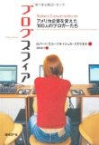

**本タイトル:** [ブログスフィア アメリカ企業を変えた 100 人のブロガーたち](http://www.amazon.co.jp/exec/obidos/ASIN/4822245292/mrchildrenonl-22/ref=nosim/)

**コメント:**   
アメリカで実名でブログを書いた人たち、特に社名まで公表した形で開設されたビジネスブログに関して、事例を紹介しながら、メリット・デメリットを明らかにしていく。特にブログと文化に関する考察は興味深い。

日本ではこういうことってまだあまり事例がないような気がする。社長ブログは一時期全盛期だったけど、ブログベンダーの社長がやっているというのが一般的だと思う。もっと規模の大きな企業の責任ある立場の人から発せられる私服の声を聞いてみたいなと思う。

**評価:**

**評価者:** へるべすと

**評価日付:** 2006–08–01

**画像(URL):**

**著者:** ロバート・スコーブル, シェル・イスラエル, 酒井 泰介

**出版年月日:** 2006–07–20

**出版社:** 日経 BP 社

**ASIN:** 4822245292
