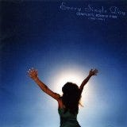

**楽曲/アルバムタイトル:** [Every Single Day -Complete BONNIE PINK (1995–2006)-](http://www.amazon.co.jp/exec/obidos/ASIN/B000FPX14W/mrchildrenonl-22/ref=nosim/)

**アーティスト:** BONNIE PINK

**コメント:**   
最初、レコード会社のサイトで視聴して、買おうかどうしようか迷ったあげくに買ってしまった CD。もともとテレビとかからたまに流れる彼女の音楽はわりと好印象だったというのもありますが。

買って正解。はまってます。

言うならば、Japanese Alternative POPS という感じか。まぁ、POPS なのにオルタナティブっていうのはおかしいのだけど、僕には ROCK という感じでもないので。

最近、こうやって出会って、これからも応援したいミュージシャンが着々と増えているのだけど、彼女もその中の一人に（やっと）入ったかな。増えすぎて困っているけど。

しかし、実家からネットで注文して、帰ってきたら宅配ボックスに届いてるって世の中便利だなぁ。

**評価:**

**評価者:** へるべすと

**評価日付:** 2006–08–23

**画像(URL):**

**メディア:** CD

**発売日:** 2006–07–26

**制作会社:** ワーナーミュージック・ジャパン

**ASIN:** B000FPX14W
