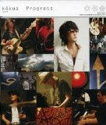

**楽曲 / アルバムタイトル:** [Progress](http://www.amazon.co.jp/exec/obidos/ASIN/B000GEIQN8/mrchildrenonl-22/ref=nosim/)

**アーティスト:** kokua, スガシカオ, 武部聡志, 小倉博和

**コメント:**   
salyu さんが出るからと POP JAM を見てたら、彼らも出ていた。

たぶん NHK つながりで、なんだろうけど、その音楽をきいて自分の体の中に突き抜けるものを感じたので思わず買ってしまった。

バンドの息がピッタリなのだ。そして無駄がないのだ。もう、芸術だと思う。

こんな気持ちになったのは、salyu さんの M-1(仮題、現在は VALON-1)以来だ。

**評価:**

**評価者:** へるべすと

**評価日付:** 2006–09–21

**画像(URL):**

**メディア:** CD

**発売日:** 2006–08–02

**制作会社:** BMG JAPAN

**ASIN:** B000GEIQN8
