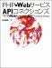

通勤時の往復の時に大抵本を読んでいます。最近はまっているのは「[The MANZAI 1](http://www.amazon.co.jp/gp/redirect.html%3FASIN=4861762537%26tag=mrchildrenonl-22%26lcode=xm2%26cID=2025%26ccmID=165953%26location=/o/ASIN/4861762537%253FSubscriptionId=02ZH6J1W0649DTNS6002) 」なのですが、もうそろそろ読み終えそうなので、次何を読もうかふらっと本屋に入ったらこんな本を見つけました。

[PHP×WebサービスAPIコネクションズ :: 秋元 裕樹](http://www.amazon.co.jp/gp/redirect.html%3FASIN=4797336838%26tag=mrchildrenonl-22%26lcode=xm2%26cID=2025%26ccmID=165953%26location=/o/ASIN/4797336838%253FSubscriptionId=02ZH6J1W0649DTNS6002)

サイボウズラボのブロガーとして有名な秋元さんが書かれたPHP関連の本です。いろんなWebサービスAPIの紹介とその使い方、つまりマッシュアップの仕方がまとめられています。まだ買ったばっかりでちゃんと読めてないですが、プログラマの技術的な部分から最近のトレンドも軽くまとめてあって、とっても親切な作りだと思います。マッシュアップをしてみたいけど、ネットの情報だけじゃ敷居が高いなぁと思ってた人（実は自分も含まれます）には最適な書籍かと思います。  
  
これを参考にして、いくつか楽しげなサービスでも実現できたらいいなぁとか思ってます。

p.s.  
  
ちなみに、MANZAIシリーズ、まじでオススメです。これ読んでると、電車を降りることを忘れそうになります。