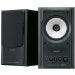
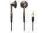
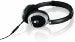

Salyu さんの TERMINAL を iPod や ITunes で聞くとなんとなく納得いかないサウンドだった。でも CD で聞くとすごく臨場感あふれるサウンドが聞こえてきた。何が違うんだろう？と思いつつ、iTunes で Apple Lossless で TERMINAL をリッピングして再生。･･･これだ！

そう、やっぱり CD の音質くらいで聞かないとダメらしい。AAC 320kbps では消えていた音もあったし。

こういう話をすると、耳の話になる。聞き分けられるとか、分からないとか。でも、そうは思わない。違いは聞いているスピーカーから生まれてくるのではないかと。というわけで、今の音楽環境をご紹介。こんな感じ。

[ONKYO WAVIO 77monitor アンプ内蔵スピーカー 15W+15W GX-77M(B) /ブラック  :: オンキョー](http://www.amazon.co.jp/gp/redirect.html%3FASIN=B0002GSQ5S%26tag=mrchildrenonl-22%26lcode=xm2%26cID=2025%26ccmID=165953%26location=/o/ASIN/B0002GSQ5S%253FSubscriptionId=02ZH6J1W0649DTNS6002)

[audio-technica オーディオテクニカ インナーイヤーヘッドホン ATH-CM700 BW :: オーディオテクニカ](http://www.amazon.co.jp/gp/redirect.html%3FASIN=B000FWGSAY%26tag=mrchildrenonl-22%26lcode=xm2%26cID=2025%26ccmID=165953%26location=/o/ASIN/B000FWGSAY%253FSubscriptionId=02ZH6J1W0649DTNS6002)

[BOSE on-ear headphones BOSE-OE :: BOSE](http://www.amazon.co.jp/gp/redirect.html%3FASIN=B000KTD81O%26tag=mrchildrenonl-22%26lcode=xm2%26cID=2025%26ccmID=165953%26location=/o/ASIN/B000KTD81O%253FSubscriptionId=02ZH6J1W0649DTNS6002)

ずいぶん、ハイエンドな環境を構築してしまった気がする･･･。というわけで、今は Apple Lossless 化を進めています。iPod nano 8GB にどのくらい入るのか。そのうち iPod 30GB が欲しくなる？かも。でも、ピュアオーディオとかっていう分野は怖くて踏み込めません。
