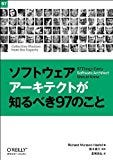

たしかTwitterで流れていた(のかな？)で知ったので読んでみました。

ソフトウェアアーキテクト、とくに”アーキテクト”っていう言葉は、日本ではアジャイルを志向すればするほど、なんとなく毛嫌いされるような感じもあったりするのですが、海の向こうでは、きちんと分業化が進んでいて、その中でアーキテクトについて、気をつけたいポイント、学ばなければならないポイントなどをコラム形式で記載してある本。短編小説ぽくって時間がないときにもささっと読めちゃう感じなのはとてもよかったです。

ソフトウェアアーキテクトな動きをしている人を間近で見たことがないので、どういう仕事なのか実は全く知らないところがあるのだけれども、これをよんでなんとなく全体像を把握できた感じ。たまに見直して、アーキテクトではないけれども、こういう動き方ができる人になりたいですね。

日本訳だけ特別に日本からということで追加してあったのですが、文章がとっても難しくて読みにくかった部分もあったので、あまり気にしない方がいいような気がします。

[ソフトウェアアーキテクトが知るべき97のこと](http://www.amazon.co.jp/gp/product/4873114292?ie=UTF8&tag=qli-22&linkCode=xm2)

オライリージャパン

発売日：2009–10–05

[ブクログでレビューを見る»](http://booklog.jp/asin/4873114292)

p.s.

この本とは関係ないですけれども、SEとかプログラマーとか、いまいち分かりにくい（定義がいろいろありすぎる）言葉ってどうにかなりませんかね？SEがsystem engineerなのか、software engineerなのかすら分からないという･･･。（つか、system engineerってなんだよ）