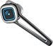

Softbankが打ち出した、iPhone大放出セール、[iPhone for everybody](http://mb.softbank.jp/mb/iphone/everybody/)。いまいち料金が分かりにくかった。特に既存iPhoneユーザにとっては。まとめると、

*   新しいホワイトプラン(パケットフル上限=4410円/月)が契約できる
*   ２年単位契約
*   解除料が9975円固定(6.3ヶ月利用で元が取れる）
*   新規iPhoneユーザは2月から申し込みできる
*   既存ユーザは4/1申し込み開始

といった感じ。

*   2年単位契約ってなに？
*   すでにiPhoneって2年単位契約じゃないの？
*   縛り期間が追加されるの？既存のままなの？

といった感じだったので問い合わせてみた。電話で。待ち時間がわりとあったけど、リミット待ち時間になったら電話が切れちゃうようなシステムではなかったので好印象。BTヘッドセットで音聞きながら、Macで作業しつつ待っていました。

いろいろ問い合わせたけど、どうやら今の契約状況に認識不足があったみたい。iPhone買った人はほとんど同じ契約のはずなので、まとめておくと

*   ホワイトプラン(i)には縛りがない
*   端末代金の割賦が24ヶ月（つまり2年間）

という状況なのだそう。で、このキャンペーンのホワイトプラン(i)に加入した場合は

*   ホワイトプラン(i)に2年契約がつくので、2011年4月1日までの契約となる
*   端末代金は別の2年間(24ヶ月)なので、2008/7/12に表参道でかった自分の場合は、2010/7/12の月までとなる（7月に始まっていないはずだから多少前後するかも）

という感じらしい。つまり、jobsが6月に次のiPhoneを出して買い替えても、ホワイトプランの契約期間には影響を与えないってことですね。(きちんとした契約期間は各自で確認しておいてくださいね）

いわゆる端末代金の支払いと回線契約という２つの軸があるので（あたりまえですが）それをしっかりと区別して理解しなければなりません、というお話でした。ま、次のiPhoneが出ても出なくても、softbankの回線契約は維持しそうなので、このキャンペーンにのってみるのも手かもしれませんね。

p.s.

どうですか？ここまで聞くと単純な棚卸しにしては大規模だなーと思ってしまうのですが。

あと、BTヘッドフォン便利ですよ。自分が使っているのはこれです。持ち歩き中でも充電できたりして便利ですよ。

[PLANTRONICS Bluetooth イヤーピース Plantronics Discovery 925 77900–16 BLACK :: PLANTRONICS](http://www.amazon.co.jp/PLANTRONICS-Bluetooth-Plantronics-77900-16-BLACK/dp/B001BTNB8C%3FSubscriptionId%3D0PZ7TM66EXQCXFVTMTR2%26tag%3Dqli-22%26linkCode%3Dxm2%26camp%3D2025%26creative%3D165953%26creativeASIN%3DB001BTNB8C)