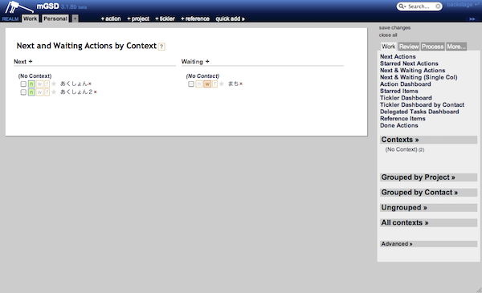

最近、仕事用のマシンがMacからWindowsに変更されまして。Windowsといえば、多くのGTDerを苦しめてきたOS(笑)というわけで、GTDをどうやって構築しようか悩んでいました。

Outlookでもいいかなと思って調べていたのですが、OutlookにおけるGTDは1メール1タスクみたいな感じで管理する方法が多く、メールでタスク管理するのが苦手な自分としては却下。そこにでてきたのが、[mGSD](http://mgsd-docs.tiddlyspace.com/)というものです。

mGSDというのは、TiddlyWikiをGTD用にカスタマイズしたもの。TiddlyWikiというのは、一枚のHTMLをブラウザから書き換えてあげることで、データベースなどを使わずにデータを格納することを可能にした優れもののwikiです。

mGSDの利点は、新しいソフトウェアをインストールする必要がないこと。手元のブラウザで使えます。もちろん、ただ一枚のHTMLなので、データの信頼性についてはよく分かりません。バックアップとってくださいとしか言いようがないです。(エンジニアであれば適当にgitとか導入しちゃえばいいんじゃないかと思います）

このmGSD、さりげなく多機能なんですよ。プロジェクトも階層をいくつでも作れるし、リファレンスも登録できるし。もちろんHTMLでOS問わずに使えるので、ぜひ試してみてください。

p.s.

Google ChromeはどうやらTiddlyWiki自体の問題としてローカルファイルの保存に失敗してしまうようです。[ここ](http://www.tiddlywiki.com/#TiddlySaver)でダウンロードできる TiddlySaver.jar というファイルをHTMLと同じフォルダに置くことで保存が可能になります。