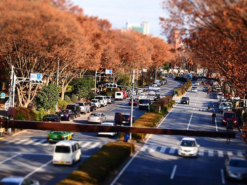

E-P3を買いました。いつもは家電量販店に買いに行くのですが、E-P3は本当に店頭在庫がないのに、なぜかAmazonが在庫を持っていたので、amazonで購入することに。E-P3の店頭在庫がないのは、タイの洪水とかでは関係ないそうなので、単にそういう計画なんでしょうかね。

カメラを買ったということはやることはひとつ。試し撮り。ということで、ちょっとお散歩してきました。念願のジオラマ

帰りに渋谷に寄ったんですが、ふと 岩井俊二監督作品 Love Letter が見たくなったので、TSUTAYAで借りてきた。

これが2回目。1回目は主人公に感情移入しちゃってたのですが、今回はいろんなものを冷静に見ることができました。あれはそういう意味だったのか、とか新しい発見もあったりして。あと、やっぱり、故篠田昇さんのカメラワークは本当にすばらしい。

JASやワープロとか、本当に懐かしいですが、Love Letterは本当にいい映画。冬と言えば Love Letter ですね。