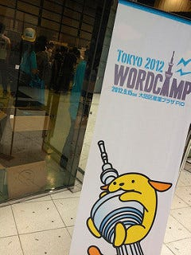

WordCamp Tokyoに参加してみました。WordCampは今回が初めて。ついでに書くと、蒲田で降りるのも初めてでした。

会場は、大田区産業プラザ。会場では、半分をWordCamp Tokyoを、もう半分で PHPカンファレンス をやっていました。２つの間に明確なしきりなどなく、ブースを回ってると気がつくとPHPカンファレンスのブースも回ってるという感じになっていました。  
  
WordCamp Tokyoはwordpressを中心にしたイベントで、CMSをカスタマイズしたりしてサイトを作る人向けでデザイナーと呼ばれる方が多いイベントで、PHPカンファレンスはPHPを書いて何かを作る（それこそwordpressも)人向けでエンジニアが多いイベントとなり、（たぶん、きっと）デザイナーとエンジニアの交流も生まれているんじゃないかなと思えました。

自分はどちらかといえばPHPカンファレンスの方がホームに近いので、Wordcampはアウェイなんですが、今回は一ブログライターとしての参加ということでWordcamp tokyoの話も聞いていました。あと仕事柄、デザイナーさん達の普段の状況とかも知っておきたかったので。

とあるセッションで、「wordpressを速くするには」みたいなテーマでのセッションがあって聞いていたんですが、「HTTPを少なくする」とか「CDN使う」とかそういう話が出ていました。インフラエンジニアの世界では5年前くらいからある話なんですが、なんとなく聴きながら疑問を感じていました。

これについてはいろんな人に回答をいただきました。やっぱり気にして制作されている方が多くいらっしゃる様子。常々気になっていたことではあったのですが、小規模で制作やられている方って、このあたり何でも屋さん的になっちゃってるなーと感じることが多いです。もちろん他に人がいないんだからしかたない部分もあるんでしょうけど、こういう分野こそインフラエンジニア的な知識のあるエンジニアが、チームとして協力するなり、アドバイザーとして協力するなり、できないものかなと。そうなると、デザイナーはもっともっと使う側の目線からいいものを考えられると思うので。

なんかそんなことを感じる日になりました。