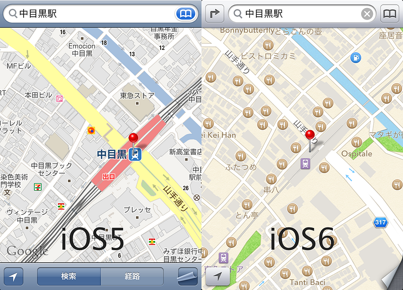

iOS6の最大のトピックといえば、新しく書き直された地図です。

iOS6の地図を開くとお店がアイコンで表示されていることが分かります。この地図は、iOS5までのように道順をさがしたりするための地図ではなくて、「近くのお店ってどんなのがあったっけ？」という疑問を解決してくれる地図になっている。つまり、ローカル検索を突き詰めた結果の地図ということができる。

いま自分がいる場所の近くにどんなお店があって、そこにどうやって行くことができるか。たとえば詳細画面に食べログのレーティングやコメントが追加されてしまえばりっぱなグルメ地図になる、といった具合に。

これまでの地図(googleマップも含む）は、建物と道路を詳細に書くことを中心においてきた。でも、Googleマップを中心にした”WEB化された地図”は、お店を探したり、場所を探すのに使われていて、次第にローカル検索という方法が一般化されてきたものの、地図自体は従来のままだった。iOS6の地図は逆にローカル検索をやりやすい形で地図を再実装を試みたものということができる。

このテストがいい方向に転がるかどうかは分からない。地図を見ていると、データを地図に落とすときに若干の間違いを犯しているように見えるのでそれは修正が必要だろうし、電車移動が多い人には若干厳しい部分があるのも見受けられる。だけれども、やってみる価値はあると思う。