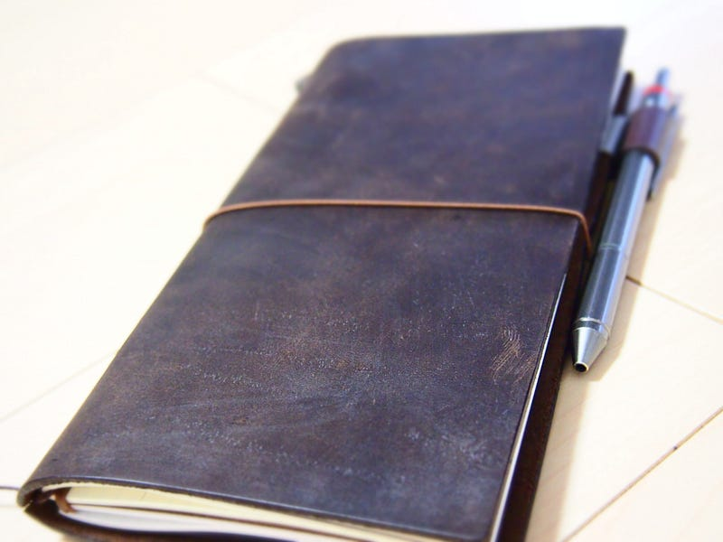

とうとう今年も発売になった来年のほぼ日手帳。ロフトに行くと、ほぼ日手帳以外にも来年の手帳が並んでいて、いよいよ年末に途中するんだなぁということを思い出させます。クリスマスにむけた年末商戦が始まる時期でもありますよね。  
  
というわけで、今年のほぼ日手帳を買いに行ったところ、お店から出るときにはトラベラーズノートを持っていました。トラベラーズノートは、リフィルを取り付けるシンプルなもの。革製のおしゃれなカバーが他の手帳とちょっと違う雰囲気を醸し出しています。

自分のほぼ日手帳の使い方は、予定、これから起こる（はずの）ことの管理というよりは、思い出、いままで起こったことの管理に使っていました。予定はiCloudのカレンダーを使っていますし、タスクだったら Things を使っています。思い出は手書きで残したいということもあって、ほぼ日手帳を使っていました。

他にもほぼ日手帳には、映画やイベント、観光地のチケットなんかが貼ってあって、記録として残してあります。デジタル化して残してもいいのですが、こういうのは現物が残っていることでふっと思い出すきっかけを与えてくれるんですよね。というわけで年末にはずいぶんほぼ日手帳が分厚くなるんです。（のでこれらがPassbookになったりするとちょっと寂しいかもな）

ほぼ日手帳によって、日ごとに思い出が溜まっていくわけですが、「あの映画いつみたっけ？」っていう時にぱらぱらめくっていくのは非効率だなって思いもありまして。どうせめくっていくのであれば、ほぼ日手帳のような1日1ページである必要性もない気がしていて。

あとはマインドマップをもっと書いていくために、広めの紙が欲しい。でも、Moleskin だと罫線がちょっと濃すぎるよな、と考えてたときに、Twitterでトラベラーズノートをおすすめされまして、買ってみることにしました。日付固定されないので、とりあえず使い始めてみようかと思います。