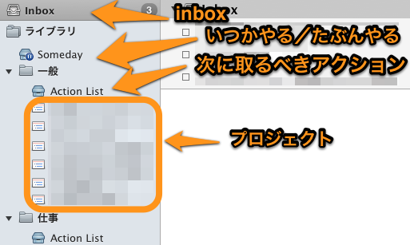
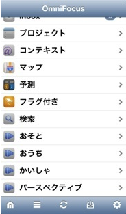

[Thingsの使い方](http://blog.qli.jp/2013/01/things2-manual-201301.html)をまとめたので次はOmniFocusの使い方をまとめておきます。OmniFocusはすでに次バージョンでUIに変更があることが発表されていますが、データ構造は変わらないため、使い方に影響があるものではないと考えています。参考までに、現在のバージョンは 1.10.4 です。

#### やっぱり全てはinboxから

Thingsと同様にOmniFocusもリマインダー経由でのタスク投稿をサポートしています（ただしiOS版のみ）。また、同期に使うOmniServerの機能として、 MailDrop という機能があります。OmniServerから提供されたあるメールアドレスにメールを送ると、メールの件名がタスクの名前として登録されるという機能です。

#### すべてはライブラリ

Thingsと比較した場合のOmniFocusの最大の特徴は、Inbox以外のタスクをすべて「ライブラリ」として扱っているところ。このスペースの使い方は自由です。自分の場合は写真の通りに作っています。次に取るべきアクションとプロジェクトリストは、より上位層のフォルダで区切っていて、これは Things でいう”エリア”を意識しています。

Thingsはどちらかというとシングルタスクに主眼をおいて考えられているのに比べて、OmniFocusはマルチタスク、つまりプロジェクトに主眼を置いています。シングルタスクも扱えますが、なるべくプロジェクトにしようという意識が働くのがOmniFocusのUIだと考えています。

#### OmniFocusの特徴は「コンテキスト」

OmniFocus1の特徴は、タスクをプロジェクトで管理するプロジェクトビューとコンテキストで管理するコンテキストビューがあることです。（OmniFocus2ではビューとしては別れません）。そして、ビューを定義するパースペクティブが重要な要素です。

コンテキストは「どういう状態だとこのタスクがアクション可能か」を表すものです。たとえば外出しているときは”errands”コンテキストのものがアクションしやすくなったり、家にいると”PC”コンテキストのものがアクションしやすくなります。これはGTDの最大の特徴です。

自分はパースペクティブを３つ用意しています。「家にいるとき」「外出中」「会社にいるとき」の３つです。

「家にいるとき」は、”MacBook Air” / “iPhone” / “home” の３つのコンテキストでアクション可能なものだけがリストに表示されるようにしています。同様に、「外出中」は、”iPhone” / “errands” の２つだけ。「会社にいるとき」は “iPhone” / “office” の２つだけになります。

置かれている状況によって取り掛かれるアクションが変わるのはごく自然なことで、これによってタスクリストを動的に変えています。そしてこれらは iPhoneやiPadで簡単にアクセス可能です。

こちらからは以上です