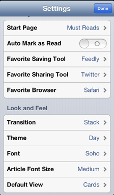

Google Readerが安らかに眠りましたね。

自分は２月からすでにFeedlyに移行を始めていて、google readerの停止の発表があった３月にはもう完全に移行を済ませていたため、今回の件で今の時期に環境を変えないといけないということはありませんでした。Feedlyの Google Reader → Feedly Cloud の移行もわりとスムーズでしたし。

Google Readerが登場したのは2005年10月。当時、RSSはBloglinesやら、Freshreaderやら、いろんなクライアントを渡り歩いていたのを覚えています。最初に登場したときのgoogle readerのインターフェースはとても使いづらく、その後のリニューアルでかなり改善されました。それから、さまざまな情報を積極的にRSSで取得するようになりました。

Feedlyに移行したのは、ちょっとしたお試し気分で、Google Readerにはいつか戻るつもりでいましたが、このバタバタで戻るに戻れず。FeedlyからTwitterやFacebookなどに気軽に記事を展開できるので、その部分では気に入ってます。

Feedlyに移行してからは、まず “must read” の記事をひと通り読み。時間があったら “All” で残りの記事を読みます。読むとはいえ、ほとんどタイトルだけ読んで気になったら”あとで読む”にしているだけで、それでひと通り一覧を見終わったら “あとで読む” にしている記事を読みに行くスタンスです。iOSアプリであれば、一枚一枚めくる感じで次に進められますし、記事の詳細をみたりするのもジェスチャーが使えるのが好きですね。

Feedlyはいろんな設定で使い方が変わりそうなので、最後に自分の設定を公開しておきます。  
  
Thanks Google Reader, Hello Feedly

