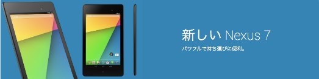

新しいNexus7が発売になりました。

触ってみましたが、前の世代のNexus7より薄く、小型化し、より片手で持ちやすくなりました。これまでもジーンズの後ろポケットに入らなくもなかったですが、より入りやすくなったのではないでしょうか。普段使いのタブレットはiPad miniですが、画面のサイズの違いはあるものの、遜色ないものになっていると感じました。もちろん、iPad miniよりNexus7の方が軽いです。

旧Nexus7からの移行はとっても簡単。Nexus7を起動し、googleアカウントでログインすると、旧デバイスで使っていたアプリが自動ダウンロードされました。アプリごとにログインする必要はありましたが、Nexus7で使っているアプリは限られているのと、Nexus7でローカルに何かを保存するというようなことはしていないので、そういった意味でも楽だったのかもしれません。ほとんど放置している間に終わりました。

新Nexus7は、旧Nexus7を使っている人は必須のアップデートと断言してもいいかもしれません。Nexus7を常用している人ほど新しいNexus7を体験して欲しいです。

なお、自分は店頭ではなくGoogle Playを通じて購入しましたが、配送はFedExでしたのでそれもあわせてお知らせしておきます。国内配送はクロネコヤマトでした。