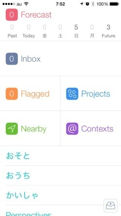
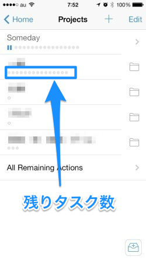

iOS7がリリースされました。と、同時に、タスク管理ソフトウェアである OmniFocus for iOSがバージョンアップしました。今回のバージョンアップは、新しいアプリとしてリリースされたので、別途購入する必要があります。これまでのOmniFocusはiTunes App Storeから削除されたとのことです。

[投稿](https://www.facebook.com/omnifocus/posts/551287688254576) by [OmniFocus](https://www.facebook.com/omnifocus).

新しいOmniFocusは、これまでのリスト型からデザインを一新しました。iOS7のカラフルなイメージにもよく合っています。

データ構造はかわっていないので、新しい機能が追加されたということは特にないのですが、みためでタスクの状況がわかりやすくなったり、細かいところに気が利いているなという印象が強いです。でも、情報量が多い割に窮屈な印象がない。iOS7の新しいiOSアプリらしいものになっています。

[OmniFocusの公式サイトもアップデートされました](http://www.omnigroup.com/omnifocus/)。OmniFocus2 for Macのリリースも近いのかもしれませんね。