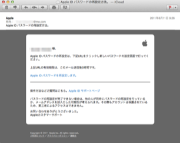

Appleさんから ユーザーに向けて送られるメールのひとつに、「Apple ID パスワードの再設定方法。」というメールがありまして。

タイトルが体言止めで終わっていて、さらにそこに”。”がいるのかというツッコミはとりあえず置いておいて。なにやら、最近このメールがとても話題になっているようなのです。

「これはフィッシングメールなんじゃないか」

それについてこれから語っていくわけですが、最初におきまりの文句を書いておきます。

これから記載することは一般的な情報です。あなたが受け取った「Apple ID パスワードの再設定方法。」というタイトルのメールがフィッシングメールかどうかは、あなたが自分で判断してください。

重要なことは、たったひとつ「正しく怖がること」です。

#### そもそもこのメールは何か

まず最初に。Apple IDに限らず、ユーザーIDだったり、パスワードを設定して、ログインして使うタイプのサービスの多くは、パスワードを忘れてログインできなくなったときのために救済策が用意されています。

Apple IDでも同様の仕組みが用意されていて、パスワードを忘れた場合は、そのIDをAppleに申告して、AppleからそのIDに基づいたメールアドレスへメールを送ることで、パスワードを設定し直すということになります。

なぜメールを送るのかというと、本人確認のためで、そのメールアドレスにアクセスできる人であることを確認することによってその代わりとしています。次に、なぜ設定してあったパスワードを表示するのではなく、再設定するのかというと、パスワードは設定された段階である一定の法則によって暗号化されていて、設定されたパスワードはシステム上分からないからです。

Apple IDでは、[こちら](https://iforgot.apple.com/password/verify/appleid?language=JP-JA)のページから、自分のApple IDを入力することによって、パスワードを設定し直すための本人確認を行います。そのメールが今回話題になっている「Apple ID パスワードの再設定方法。」というタイトルのメールなのです。

詳細は、[Appleのヘルプページ](http://support.apple.com/kb/HE36?viewlocale=ja_JP)でも解説されています

#### これは問題なのか

ここまでで理解できたかもしれませんが、Apple IDのパスワード再設定の要求は、そのApple IDを持っていない人でも可能です。特にiCloudメールを利用していれば、IDのドメイン部分は @iCloud.com と固定ですから、あとは @ の前に好きな文字列をランダムで入れるだけです。

このメールはDKIMという差出人を偽ることを防ぐための仕組みを使って送信されています。ですので、差出人を確認して、Appleのアドレスであれば、ほぼ問題ないことになります。もし、Appleのアドレスでなければ、メールとパスワード設定サイトをそっくりにつくった偽物である可能性が高いでしょう。

一番大事なことは、このようなメールが来ても驚かないこと。そして、パスワードを再設定するような手続きをしていないのであれば無視することです。

特にここ最近、メディアによっては敢えて煽ることによって、リツイートなどを誘い、アクセス数を増やそうとするものもあります。そういうものがあっても、まず現物を確認してみることが大事なのではないでしょうか。知ること、そしてその情報をもとに「正しく怖がること」です。