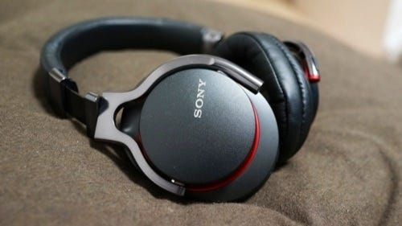

この時期ってなぜかとても音質にこだわりが出てしまうんですよね。クリスマス商戦の誘惑と、冬という季節的なところが重なっているからでしょうか。わりと毎年なんらかの音楽機器を買っている気がします。そういえば、関東の冬は本当にとても乾燥していて、毎年驚いています。

そんなこんなで、MDR-1Rmk2を買いました。ソニーのハイエンドヘッドフォンです。昨年出たMDR-1Rも興味を持ちつつ、昨年はタイミングを逃して買わなかったんですが、結局今年mk2を買ってしまいました。

Bluetooth付きのMDR-1RBTmk2も、ノイズキャンセラ付きのMDR-1RNCmk2も、それぞれに興味を持っていました。もともとの目的が、iTunes Storeでレンタルした映画や、DVDを見るときにアンプに繋いで使うためのものだったことと、この大きさのものを外で使うことは考えなかったこと、それから実際に店頭で試聴してみて、これら２つの音が気に入らなかったので、ノーマルなものを選ぶことにしました。

聞いていて疲れないこと、つけていて耳が痛くならないこと、など、まだ使い込んではいませんが、やっぱりすばらしい音を聞かせてくれます。自分の中で、ベンチマークにしている曲があって、 “VOYAGE CALL” (in MAIDEN VOYAGE by Salyu) という曲なのですが、本当にいい音を奏でてくれていることをはっきり認識できました。

[**MAIDEN VOYAGE 【通常盤】**  
_MAIDEN VOYAGE 【通常盤】\] Salyu - CD・レコードの購入はオンライン通販アマゾン公式サイトで。お急ぎ便ご利用で当日・翌日にお届け。_www.amazon.co.jp](https://www.amazon.co.jp/gp/product/B0031WUWY8/ "https://www.amazon.co.jp/gp/product/B0031WUWY8/")

ここのところ、どこかSONYづいてますが、ZX-1は購入しません。