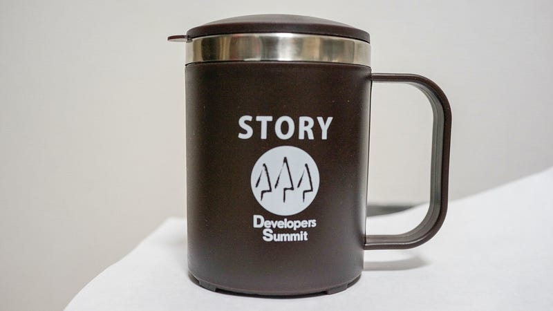

今年も Developers Summit に行ってきました。場所はいつもの目黒雅叙園。Amazonさんのオフィスの隣の建物です。今年はこっそりとコーヒースポンサーとして参加しました。

#### コーヒースポンサーのススメ

コーヒースポンサーは、いわゆる個人スポンサーのことで、あらかじめ申し込みをすると、コーヒースポンサーになることができます。公式WEBサイトの方ではコーヒースポンサー一覧ということで、写真一覧がありますが、諸事情により自分のアイコンはありません。

コーヒースポンサーのメリットは、無限コーヒーと、前方に設けられたコーヒースポンサー席に(先着順で)座れること、そして、コーヒースポンサー用控え室が使えるようになるという感じでしょうか。とても満喫できました。

受付の際にいただいたマグがとても便利なので、今後も使いたいと思います。

#### 今年のデブサミ

今年のデブサミは以下のセッションを聞いてきました。

*   13-A-1 : クラウドがもたらした多様な破壊と創造
*   13-C-3 : Smashing Android UI, Androidデザインの極意
*   13-B-4 : 事例から学ぶDevOps実現のためのプラクティス
*   13-A-5 : 成功と失敗の狭間に横たわる2つのマネジメント
*   13-B-7 : 何故クックパッドのサービス開発は日々進化しているのか
*   14-A-1 : Webの現在過去未来
*   14-D-3 : 越境する開発 ～あの日開発していたサービスの名前を僕たちはまだ知らない～
*   14-D-4 : デベロッパー戦国時代！ストーリーをつなぐ開発環境と3つの秘訣
*   14-D-5 : iOSアプリケーションの継続的デリバリー ～エンタープライズ品質のiOSアプリケーションを目指して～
*   14-B-7 : なぜ、システム開発は必ずモメるのか？ プロジェクト見積もりから契約作成まで

個別の話もいろいろあるのですが、全体としてキーワードになったのは「期待マネジメント」なのかなと思います。  
僕たちは作る側なので、

*   発注元（パトロン）からの期待
*   使用者（ユーザー）からの期待

というのを常に気にしながら、暴走しないようにコントロールする（これをマネジメントといいますね）ことが大事なのかなと思いました。特段新しいことではないですけどね。また、特に、ユーザーからの期待については、UXという文脈で語られていることも多いですね。

Developer Summit は、イベントの性格上、どうしてもエンジニアリングの話に終始しがちなので、もし、デザイニングの話で同じようなイベントがあれば話を聞いてみたいなとも思いました。

Engineering + Designing = Created Thing (Our Product!)

だと思います。

今年は2日目が雪の影響もあり、終了時間を早めるために休憩の時間が5分短くするなどの対応がありました。やっぱり15分での部屋の転換はバタバタしていましたが、それでもきっちりご対応されていたスタッフの皆様に感謝です。

ありがとうございました。そして、きっと来年もよろしくお願いします。