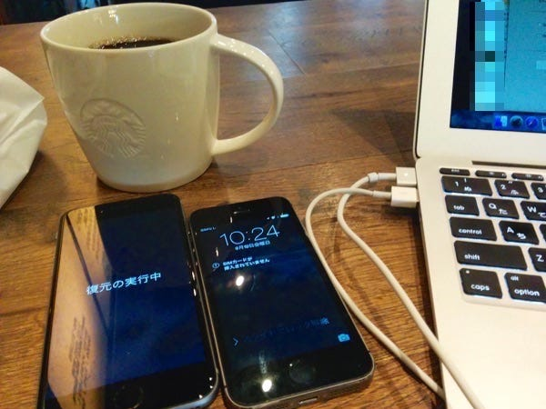

Apple Store Onlineの方ではなく、Apple Storeの店頭受け取り予約を9月12日に行い、いま受け取りに行ってきました。  
受け取り前に、iTunesで暗号化バックアップをしていたため、書き戻しました。  
暗号化バックアップは、セキュリティ的な部分も含めてバックアップをしてくれるのでおすすめです。

購入したのは、iPhone6 スペースグレイ 128GBです。iPhone5s スペースグレイ 64GB からの乗換なので、画面が大きく、容量が大きくなりました。

iTunes Matchが日本に到着して初のiPhone変更ということになったのですが、音楽をiTunesから同期するわけではないので、セットアップが非常に早く終わりますね。

#### Apple Store, Omotesando

今回は新しくできた表参道店で受け取りしてきました。Apple Storeの予約は1時間ごとに枠が切られていました。  
予約した時間よりも少し早いタイミングで到着したのですが、予約済み列の2番目で、比較的スムーズに案内され、とても落ち着いた店内で手続きができました。実は予約した時間にはすでに購入が終わっていました。

発売最初の週末はいつも喧噪の中、バタバタと契約を進めていく記憶があるのですが、今回は事前予約もあったためかとてもスムーズでした。徹夜で並んだ予約なし当日列も比較的スムーズに案内されているようでした。

#### 大きさ

iPhone 6の大きさは Nexus5 と全く同じ。写真だけでは気がつかなかったのですが、電源ボタンが上から横に変更されました。画面の上部に手が届くことはまったく諦めたようです。Sony MobileのXperiaは、デバイスの真ん中に印象的な電源ボタンを配置することでアイコン化していますが、携帯電話のデザインとしてはそういうのもアリなのかなと思ったりしています。

それ以外は本当にiPhoneです。Facebookアプリなど、アプリがそのまま拡大されただけで、広いスペースを使いこなしていない違和感は感じましたが、それは今後解消されていくのでしょう。iPhone6でも違和感感じたので、6 Plusでは相当なものかもしれないですね。