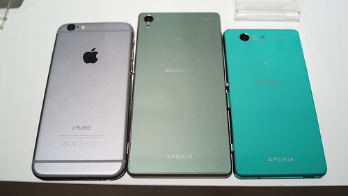
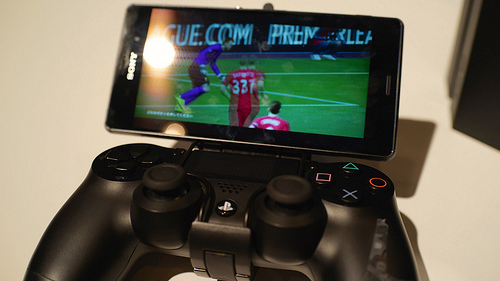

NTT docomo / au / Softbank の3キャリアから出ることが発表されているXperia Z3の体験会 “Xperia アンバサダーミーティング” に行ってきました。

まず最初に開発陣の方からXperia Z3についてのお話があったあと、実際に触ったりしてみました。

とはいえ、ソフトウェアの部分はAndroidということでとてもなじみがあったので、外観が中心になってしまいました。

#### 外観

基準は今使っているiPhone6となってしまいますが、Xperia Z3がちょっと大きく、Xperia Z3 compactが小さい感じ。

Z3 Compactは、Xperia Aシリーズを彷彿とさせるサイズ感で、Xperia Z3と同じ質感ながら、ホールド感もよく、大きいのはちょっと、と思っている方にはちょうどいいのかもしれません。

#### Remote Play with PlayStation4

今回の注目のひとつに、PlayStation4の Remote Play があります。PlayStation4のゲームを Z3の画面上にうつしながらプレイできるというもの。音もZ3から再生されます。

（なぜかFIFA15体験版が用意されていたのですが）、映像と音をWi-FiでplayStation4からZ3に飛ばす仕組みとのことなのですが、遅延も感じずに快適にプレイできました。

それ以外にSmartWatch 3のデモもありました。いわゆるAndroid Wareなのですが、音声で操作するデバイス。どちらかというと、その横に展示してあった Smartband Talk に惹かれてしまいました。

Smartband Talkはいわゆる通知デバイスなのですが、通話ができるデバイスとのこと。なぜ腕で通話というスタイルを提案することになったのか気になります。（街を歩きながら腕に話しかけている人をみたらビックリするかと）

Smartband Talkの外観は Fitbit Flexにも似ていて、好感が持てました。

#### Like a Steadicam

今回の体験会のテーマになってしまったのが、Z3の電子式ぶれ補正技術であるインテリジェントアクティブモード。「光学式ぶれ補正技術が某社のケータイに搭載される時代なのになぜいまさら電子式に？」というのが質疑応答の結果テーマになっていました。もちろん、光学式はそれ以前から搭載されているものでもあります。

その某社のケータイと比較したりとか一部でやっていまして、Z3がそれらに比べてもよりステディカムに近い状態であることがわかりました。はっきりわかる状態だったので相当なモノだと思います。が、それを好むかどうかは人それぞれな気もしますね。いわゆる”人間くささ”が排除されかねないですから。

#### リンク

[**Xperia™ Z3 SOL26 | ソニーモバイルコミュニケーションズ**  
_ソニーモバイルコミュニケーションズの携帯電話「Xperia(TM) Z3 SOL26」の製品情報。_www.sonymobile.co.jp](http://www.sonymobile.co.jp/xperia/au/sol26/ "http://www.sonymobile.co.jp/xperia/au/sol26/")

[**Xperia™ Z3 Compact SO-02G | ソニーモバイルコミュニケーションズ**  
_ソニーモバイルコミュニケーションズの携帯電話「Xperia(TM) Z3 Compact SO-02G」の製品情報。_www.sonymobile.co.jp](http://www.sonymobile.co.jp/xperia/docomo/so-02g/ "http://www.sonymobile.co.jp/xperia/docomo/so-02g/")

[**SmartWatch 3 SWR50 | ソニーモバイルコミュニケーションズ**  
_機能やデザインに加えて、ソニーモバイルがおすすめするSmartWatch 3用のアプリをご紹介。_www.sonymobile.co.jp](http://www.sonymobile.co.jp/product/smartwear/swr50/ "http://www.sonymobile.co.jp/product/smartwear/swr50/")

[**SmartBand Talk SWR30 | ソニーモバイルコミュニケーションズ**  
_ソニーモバイルコミュニケーションズのアクセサリを紹介。「SmartBand Talk SWR30」の製品情報。_www.sonymobile.co.jp](http://www.sonymobile.co.jp/product/smartwear/swr30/ "http://www.sonymobile.co.jp/product/smartwear/swr30/")