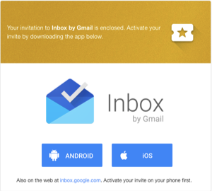

inboxのinvitationが届いたので早速使ってみました。

inboxは新しいメールサービスです。新しいメールサービスとなると、その価値を判断するためにしばらく使いこなすという作業が必要になります。  
しかし、inboxではメールのデータ自体はGmailと共有しているため、Gmailを常用している方はメールが溜まった状態で使い始めることができます。

少し触ってみて、inboxは大きく「メール」のあり方を変える可能性があるなと感じました。

Gmailは、受信箱とアーカイブ、そしてスターというシステムによって、inbox zeroの容易性をもたらしました。  
メールを読んで、あとで必要になるメールにはスターをつけてアーカイブにしておくというスタイルです。

そして、inboxは 「カテゴリ」によって、メールという世界を大きく変えようとしています。  
受信箱には新着メールが「カテゴリ」で分けられて表示されます。

inboxでは、まずスターがありません。  
メールに対する大きなアクションは、「Snooze(先送り)」と「Done(完了)」です。

*   Doneは、いわゆるアーカイブに近いものになります。
*   Snoozeは、メールの処理自体を先送りすることです。受信箱からは見えなくなります。指定された時間にはpinされて表示されます。

そして、それ以外に「pin」と「Reminer」があります。

*   Pin は、inboxにとどまるものになります。
*   Reminderは、タスク化して受信箱とは別のリマインダーリストに置いておきます。

Gmailと同じような使い方をするのであれば、GmailでスターしたいメールにはReminderでタスク化しておく、ということをおすすめします。  
慣れてくれば、Gmailとは異なるメールの世界が拡がっていくのではないでしょうか。

メールの受信だけをサポートしてそれ以外は干渉しない既存のメールシステム。  
Googleの検索の力によりアーカイブとスターによって受信箱にメールをためないことを実現したGmail。  
そして、inboxは先送りとリマインダー（タスク化）によって、メールの扱い方を新しいステージへ持っていこうとしています。

追記(10/29 1:16pm):

inboxの検索でもGmailのキーワードがきくのかわからないけれども、”is:starred” で検索するとinboxでもGmailでスターをつけたメールが検索できるとのこと。