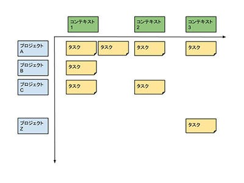

タスク管理のアプリやツールは、iPhone登場したこの7年間で非常に多くのものが出てきました。それまでのガジェットでも必ず作られるものではありましたが、GTDが受けいられれてきたこととスマートフォンの登場（携帯電話端末の高度化）と相まって、さまざまなアプリやサービスが登場しました。

その中でもおそらく多くの人が知っているのがOmniFocusです。そして、iPhoneが登場してすぐ、その洗練されたUIに多くの人が魅了されたのが Things でした。この２つが登場してしばらく、OmniFocusかThingsか、というのは多くのiPhoneタスク管理ユーザーの中で語られることの多いトピックでした。

ところで、GTDはタスクフローが有名ですが、そのフローで作られた「信頼されたシステム」の中では、タスク管理をマトリックスで行います。一つの軸はプロジェクト、もうひとつの軸はコンテキストです。

プロジェクトは、簡単に説明すれば「実現したいこと」です。その「実現したいこと」を行うための作業が”タスク”としてブレイクダウンされます。日本語が動詞よりも形容詞が先という構成で、それに慣れていることから、日本語を母国語として使っている人はタスクから入りやすいというのはよく言われたりします。

コンテキストは、タスクが実行できる状況のことです。GTDでは、ちょっと空いた時間をつかってタスクにとりかかったりします。空いた時間ができたタイミングが、「出かけている」のか、「自宅にいる」のか、その置かれた状況によって実行できるタスクは当然違うので、その状況に応じたタスクリストを作っておきましょう、ということです。

週次レビューにて、プロジェクトでの管理でもって最新状態にし、普段の作業時はコンテキストをもとにしたリストでタスクをこなしていく。これがGTDのもっとも根底にあるものです。

週次レビューの時以外はプロジェクトを意識しないのが理想なんだろうとは感じています。もし1週間で1度しかプロジェクトを意識しないことを不安に思うのであれば、それはよりカオスに近い状況にいるということかもしれないので、レビューのタイミングを増やす必要があるのかも知れません。

OmniFocusでは、このマトリックス型の管理を、プロジェクトビュー / コンテキストビューとして、２つのビューを用意することで実現しています。それ以外のアプリ、Thingsでも同様ですが、コンテキストを”タグ”として実装していて、プロジェクトビューの中でタグによる絞込によって実現しています。

GTDのマトリックス型タスク管理システムの中でもっとも使用頻度が高いのは、コンテキストによるタスクリストだろうと思います。自分にあったシステムを用意しておきたいところです。

p.s.

Thingsのような、”今日やることリスト”があるアプリの場合は、もしかすると、毎日レビューをやってあらかじめ予定を確認しつつ、コンテキストをみてタスクを絞り込んでおく、という作業が必要なのかもしれませんね。

なお、OmniFocusは いま OmniFocus2 for Mac の開発中。Thingsは Things 3が開発中とのこと。