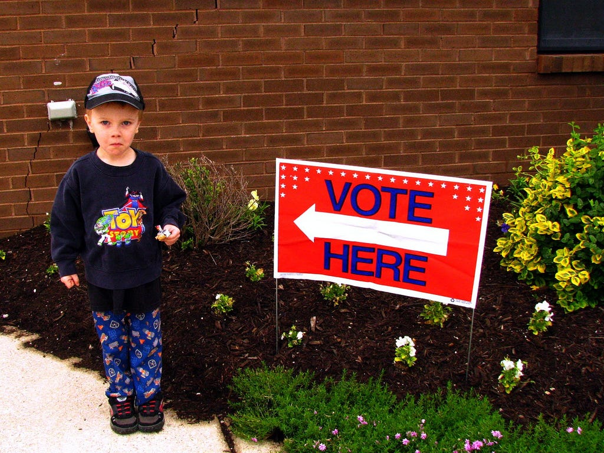

Some rights reserved by Teeny! http://www.flickr.com/photos/godby51/2509282182/sizes/l/

東京都に直接関係ない人にはごめんなさい。これから東京都知事選挙について書きます。

東京都知事選挙のニュースが毎日賑わせています。Twitterをはじめとして、さまざまな媒体でさまざまな議論が行われています。

ところで、今回の選挙の投票日は2月9日に設定されています。カレンダーを見てみましょう。

*   2月8日(土曜日)
*   2月9日(日曜日): 投開票日
*   2月10日(月曜日)
*   2月11日(火曜日): 建国記念日

となっています。つまり、10日をおやすみにすると4連休となります。

4連休の間に投票に行くでしょうか？これまでの流れから考えると、これまですべての選挙に投票に行った人くらいでないと投票に行かないのではないかなと考えられます。投票日がどうやって決められるか分からないですが、意図的でないことを願うだけです。

投票日には必ず”投票へ行こう”というtweetをしてきたのですが、今回だけは違います。”期日前投票に行こう”を訴えていきたいと考えています。

期日前投票に行こう