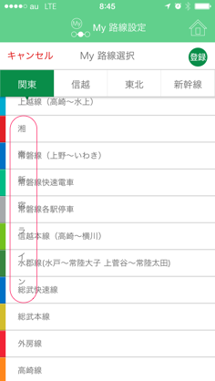

JR 東日本が、公式アプリを出した。

[JR 東日本アプリ：JR 東日本](http://www.jreast-app.jp/)

これまで、通知用のアプリは出ていたが、今回改めて電車に関する総合的な情報を提供するアプリとしてリリースしたようだ。JR 東日本は、自分で運行している業者なので、電車に関する情報を一番早く知ることができる。そういった意味も含めて、リリースを知った当時は、自分もこんなツイートをした。

ITmedia の記事によれば、JR 東日本アプリはどこで起動されたかを知るために、音波を使って把握する技術 Air Stamp を使っているらしい。開発元はドコモだ。

[「JR 東日本アプリ」山手線情報サービスのミソは「音波」 ドコモの音波チェックイン「Air Stamp」採用](http://www.itmedia.co.jp/news/articles/1403/05/news071.html)

音波を使うということは、マイクを使うということで、それは iOS の場合、音声入出力そのものをジャックすることを意味する。そして、自分もそうなのだが、電車を利用しているときは音楽を聴いていることが多い。

使ってみてすぐにこんな感想を持った。

音楽が止まるのだ。イヤホンしているので、おそらく iOS の場合は本体のマイクではなく、イヤホンのマイクを使おうとするのだと思われる。これは非常に悪いユーザー体験を与えてしまっているのではないか。

そして、ボタンが非常に押しにくい、かつ反応したのかどうかよく分からない。フラットデザインで気をつけなければならないところが、まったく気がつけられていない印象を強く持った。ドッグフーディング、つまり作った人が自分で使ってみたりはしていないのだろうということがよく分かる。

そして、挙げ句の果てには、謎の縦書きである。

