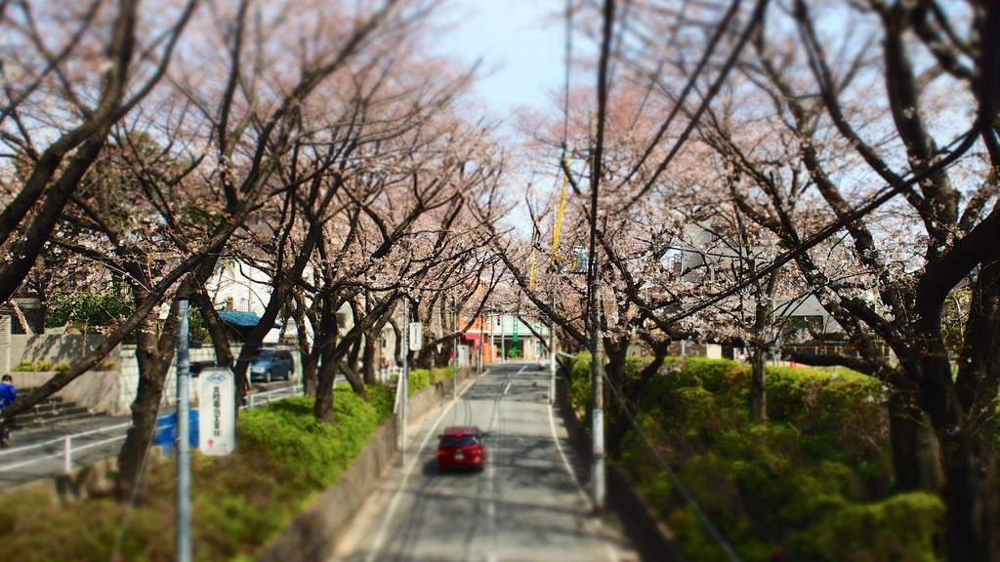

オリンパスの新しいカメラ E-M10 が届きました。

予約していて、E-M10 シルバーは2月末に発売になっていましたが、ブラックは3月末まで待たされました。消費税8%化で、配送であるクロネコヤマトさんの物流量が飽和しているという話もあり、ひやひやしましたが、なんとか受け取ることができました。[OM-D E-M10予約キャンペーン](http://olympus-imaging.jp/event_campaign/campaign/c140129a/index.html) は3月31日がユーザー登録締切だったのですが、物流量飽和のためなのか、4月11日まで延長されていました。

E-M10の試し撮りにさくら坂に行ってきました。ちょうど東京も桜が開花していました。

E-M10とあわせて、電動ズームレンズ “M.ZUIKO DIGITAL ED 14–42mm F3.5–5.6 EZ” を自動開閉レンズキャップ付きで導入したのですが、これだと本当に機動力が増しますね。E-M10の軽さやAFの速度など、全体的に軽さを感じます。Eye-fi Proとの連携もとてもスムーズでした。ちなみにE-M10は本体にWiFi機能を内蔵していて、専用アプリでスマートフォンでダウンロードしたりできるのですが、手順が多かったので使うのをやめました。