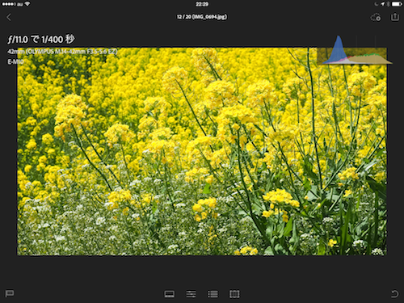

Lightroom mobileがリリースされました。iPhone版とiPad版が用意されているみたいですが、いまのところiPad版のみのリリースとなっています。

少し触ってみましたが、さすがプロ用の写真管理ツールというだけあって、Adobe Revelとは情報量が異なりますね。その情報量をとても使いやすくまとめているのは好感が持てました。少し操作を覚える必要があるので、学習に時間がかかるかもしれないですね。

Creative Cloud を使って、LightroomとLightroom mobileで写真を同期することができます。普段から写真をLightroomで管理している人には、とても有用なツールなのではないでしょうか？

#### Lightroom vs Revel

iPad版ではカメラロールから写真を読み込むことができますが、iCloudフォトストリームからは読み込むことができないようです。また、明示的な読み込み動作が必要なようでした。Revelはカメラロールから自動で保存できます。プロ用とコンシューマー用というコンセプトの違いでしょうか。

RevelはMac版のアップデートが長いこと止まっているほどモバイルに特化しているのに対し、Lightroomはnon-Macだと厳しいところもあるかもしれないと考えています。

Eye-fiでiPhoneに転送するようにしているので、写真の読み込みをできるようにするために、Lightroom mobile for iPhone を待ちたいと思います。

#### Creative Cloud vs iCloud

iCloudは、ファイルを自動で転送するということです。今回Lightroom mobileの登場でCreative Cloudの真価が問われるわけですが、Creative Cloudは画像の編集も転送してくれます。iPadで画像のフィルターを変えると、Mac側でも自動で反映されます。

そう考えると、汎用的なiCloudよりも画像に特化したCreative Cloudのアドバンテージが大きいと思えます。

Aperture/iPhoneの Mac/iOSへの統合度があまりにも大きく、Apertureからの完全移行はそれなりに失うものもありそうな感じですね。