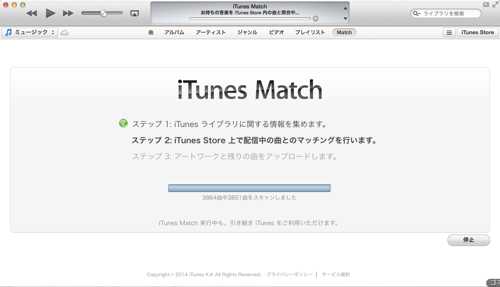
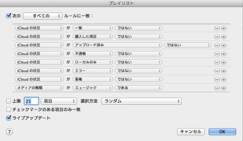
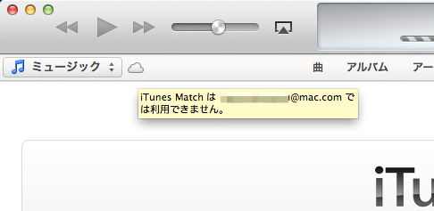

iTunes Matchが5月2日に突然日本でサービス開始されました。

午前中の段階でiTunes Matchに申し込み、処理が開始されたものの、これを書いている5月3日12pm現在、まだ終わっていません。Step 2で止まっています。この現象は、米国で開始されたときも同じような騒動になっていて、”iTunes Match Stuck”で検索すれば記事が見つかると思いますが、日本語圏ではまだ充分な情報がなさそうなので、ここでまとめています。

最初に触れておきますが、iTunes Matchが各プロセスで止まるというのは、とても時間がかかっているが表示上止まっているようにみえるというのが大半のようです。なので、英語圏のブログでは、startとstopを繰り返したらうまくいったというのもありますが、おそらく別の同様の現象にも使えるパターンにはなっていないと思われます。  
簡単に書けば、(Appleではいつものように)iTunesが出力する情報が少なすぎて、トラブルシューティングのパターン集を作れないというのが現状ではないでしょうか。

というわけで、ここでは以下の２つを書いておきます。

*   iTunesが処理している楽曲を知る
*   iTunes Matchの処理をやり直す手順

#### iTunes が処理している楽曲を知る

iTunesが処理している楽曲を知るためには、以下のスマートプレイリストを作ります。

文字で書き起こしておくと、「iCloudの状況として選択肢にあるもの以外の状態の音楽」を表示するプレイリストになります。すると、”iCloudの状況”欄に、点線で書かれた雲が見えるはずです。点線に書かれた雲はマッチングプロセス待機中という状態です。

*   [iTunes Match：iCloud のステータスアイコンについて](http://support.apple.com/kb/ts4124?viewlocale=ja_JP)

#### iTunes Match のマッチングプロセスをやり直す

しばらく止まっているときに、iTunes MatchをOFF/ONすると、進捗がアップデートされることがあります。あくまで推測ですが、やりなおすと進むというより、進捗のアップデートをさぼっていたのがみえるようになるだけのようです。

iTunes Matchでは、Genus mixもiTunes Match用のものに更新されるため、iTunes MatchのON/OFFの際にあわせてGenusの情報もアプデｰとする必要があります。というわけで、以下の手順を踏みます。

1.  iTunes Match をオフ
2.  Genusをアップデート
3.  iTunes Match をオン

*   [Thanks Brad on Apple Discussion](https://discussions.apple.com/message/22807360#22807360)

Genusをあらかじめオフにしておくという案もあるようですが、そちらは実施したことがありません。

#### 追記(2014.5.3): iTunes の左上のクラウドアイコン

iTunes Matchをオンにすると、iTunesのメニュー横にクラウドアイコンがあらわれます。これがなにを意味しているか分からなかったのですが、どうやらiTunes Matchの動作状況を表すアイコンのようでした。しばらく「利用できません」という状態しかみていないように思えます。

