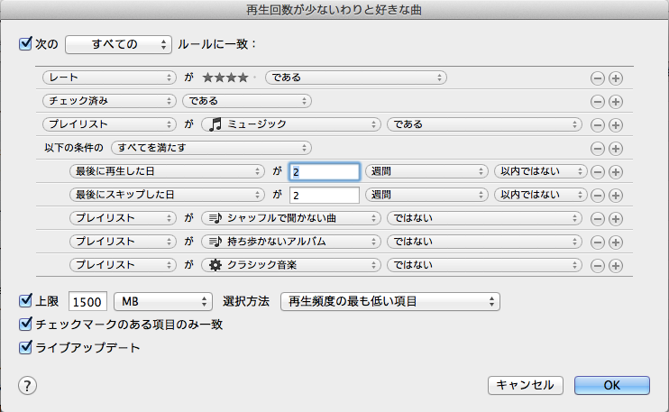

iTunes Matchを便利に使っている。とはいえ、CDを買ってきてリッピングするたびに、マッチング処理が終わらないと、iPhoneからアクセスできないタイムラグはちょっとつらいときがある。普段は問題ないのだけど、たまに処理がStuckしたりする。

それはそれとして、iTunes Matchの制限事項として、他のプレイリストを参照しているスマートプレイリストは同期されない。これまでは、プレイリストを重ね合わせたスマートプレイリストを使って曲を聴いていたりしていたのだけど、それが使えなくなった。

最近はもっぱらジーニアスMIXを使うようになった。あとは、最近買った音楽を入れているプレイリストとか、ライブのセットリストで作ったプレイリストとか。音楽の体験が少し変わった気がする。

**追記**

追記しておくと、iTunes Matchを使うようになって、Last.fmの使用を止めた。対応しようとするとそれなりに考えなければならないことが多く、ROIがよくないのと、そもそもiPhone以外、Apple TVとかでも音楽を聴くことが増えてきたので。