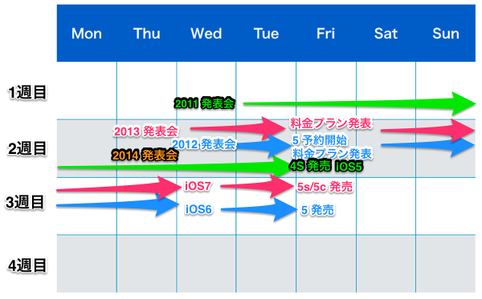

Appleが9月9日に発表会を行うという噂が Re/code を始め、さまざまな噂サイトで報道されました。

これで9月9日発表会はほぼ確定したと考えてもいいと思います。これまでの流れからすると、おそらく発表会は9月9日10時（現地時間）から。日本時間だと9月10日午前2時になる予定です。

*   [Event Time Announcer by timeanddate.com](http://www.timeanddate.com/worldclock/fixedtime.html?msg=Apple+Media+Event+September&iso=20140909T10&p1=1239)

正式な決定はメディアに送付される招待状を待つ必要がありますが、例年であれば1週間前に送付されるので、9月2日前後に送付され、発表会正式発表報道が出るのではと考えられます。その招待状にどのようなメッセージが描かれるかはいつも注目です。

ちなみに昨年の招待状のメッセージは、

> This should brighten everyone’s day.

でした。この時は、スタンダードなiPhone 5sとカラフルな5cが発表されました。

*   TechCrunch: [Apple、9月10日のiPhoneイベント招待状を報道陣に発送](http://jp.techcrunch.com/2013/09/04/20130903apples-september-10-iphone-event-now-official-as-invites-sent-to-press/)

#### 秋の発表会

秋の発表会は、いわゆるAppleのiPhone発表会と位置づけられます。

そもそもAppleがiPhoneを秋から冬にかけて発表されるのは、年末年始の「もっとも商品が売れる時期」を狙ってのこと。iPhoneに限らず、MacBookなどの商品が発表されてもいいはずですが、やはりAppleは一番売れる商品であるiPhoneにフォーカスしてその魅力を伝えることを最大限の効果として狙っているようです。

#### iPhone発売のスケジュール

ここ３年のiPhone発売スケジュールをまとめてみました。

2013年(iPhone 5s/5c)と2012年(iPhone 5)は９月発売、2011年(iPhone 4S)は10月発売ですが、それぞれの月で何週目にどういうことが起こったかをマッピングしてみました。これをみて何かがわかるでしょうか？

#### iOS アプリ 開発者から

iOSアプリ開発者の目線から捉えれば、今回のリリースはとても大きなものになります。

Appleがいつ新しいOSのためのアプリの審査を受け付けるか、を発表するのもこの秋の発表会であることが多いです。Appleが公表しているように、iPhoneの新しいバージョンへの移行は比較的スムーズに行われます。したがって、アプリは常に新しいOSへの対応を迫られます。

開発者は発表会までに準備することも多いですが、スケジュールが確定するここから開発者の準備が本格化します。

#### 最後に

発売日には今年も行列ができると思われます。2012年、2013年と、キャリアの契約システムのリクエストキャパ超えによって、順調に進まないということもありました。発売日は端末在庫が売り切れるという心配よりもシステムが正常にうごくかというリスクのほうが大きいようです。そうでなくても、契約ごとですから、一人あたりの対応時間はそれなりに掛かると思います。個人情報を扱うシステムですから、端末数や対応者を無尽蔵に増やすというわけにも行かないのだと思います。

毎年、午前中で行列から解放されると思い「仕事をさぼってきた」という人が結局一日中行列に拘束されるというケースが散見されます。ぜひ並ばれる方はその日のスケジュールを全部調整して並ばれることをおすすめします。