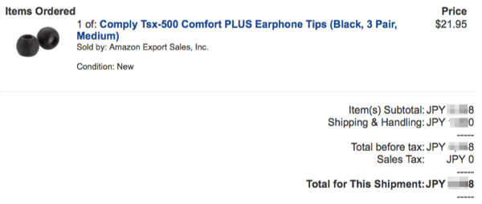

普段イヤホンは Atomic Floyd SuperDarts Titanium + Remoteを使っています。このイヤホン、イヤーチップとして最も標準的なシリコン製のものとは別にフォームチップがついています。

[**「イヤホンチップ、意識してますか？」− あなたが使っているのはどれ？ イヤホンチップの種類を解説 (1/2) - Phile-web**  
_オーディオ＆ビジュアルのポータルサイト。ヘッドホンやハイレゾ音源、ネットオーディオなど、いま旬の情報＆レビューをいち早くお届けします！_www.phileweb.com](http://www.phileweb.com/review/article/201210/12/590.html "http://www.phileweb.com/review/article/201210/12/590.html")

普段はこのフォームチップを使っていたのですが、フォームチップは使い込むほど、耐性がなくなってしまうんですよね。ということで、買い換えることにしました。

イヤホンのスペックを調べてみるとついてきたフォームチップはイヤホン用のカスタマイズ品ではなく既製品であることが分かりました。Complyというメーカーの TSX-500というものとのこと。そしてこれが日本で販売されていないということまで分かりました。

というわけで、Amazon Japanで探すと、並行輸入品が10000円前後で購入することができるようです。ところが、Amazon.com で探すと、送料込みで5000円程度で買えることが分かったのです。

で、オーダーするわけですが、Amazon.com は日本円での購入が可能なんですね。

いや、ビックリしました。Amazonがレート変換するか、カード会社がレート変換するかの話でしかないですが。