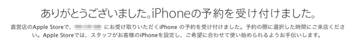

iPhone 6を予約しました。

予約したのは、iPhone 6 128GB Space Gray です。SIMロックフリーではなくキャリア契約分です。予約時間に表参道店に受け取ってきます。

#### Apple Store で予約した理由

これは去年と変わりません。Apple Careを一括で購入するには、Apple Storeである必要があったこと。そして、Apple Store, Omotesando オープン以来はじめてのiPhone発売ですから、表参道店で購入してみるのが一番だと思いました。

#### iPhone まつりは静かに

iPhoneが行き渡ったから、4S/5/5sで満足している方が多いから、でしょうか。今回のiPhone予約祭りはとても静かに思えました。

事前に並んでいた人もいたようです。今回はiPhone 3GSの時以来でしょうか、iPhone販売は予約メインで進めることにしているようです。

当日分は潤沢に用意していると思いますが、iPhone の発売当日の障害要因は在庫ではなく、システムが順調に動くか、にあります(おそらくここ数年当日に在庫が売り切れた例はありません)。そして、当日並んだ人は、予約した人が順調に進んだ結果の隙間での対応になります。

#### 派手なメディアイベントは何のために

Apple Storeの行列は、主に iPhone をバズらせるための演出です。それが予約中心になった。あれだけ派手に力強く発表した iPhone 6 / iPhone 6 Plus がそのような売り方をされてしまうのは理解が難しい人もいるのかもしれません。

そもそもあのイベントは歴史的なものでした。正しく書けば、Appleが意図的に歴史的なものになるように演出を施しました。なにが起こるのかといえば、きっとこの後の “more things” のための狼煙なのではないか。今はそう感じています。

噂では10月にiPad向けの発表会を開くとのこと。この後には、OSXの劇的なUIの変化をもたらす OS X Yosemtie が控えています。ホリデーシーズンまでに、iPod Classicが消えた以上の何かを披露するのかもしれません。