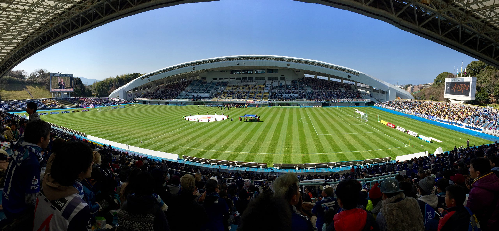

J2リーグが開幕した。今年からJリーグ Div 2ではなく、J2リーグだ。

新しい資本によって、新しい船出を始めたアビスパの開幕を見に福岡まで行ってきた。往復5時間の日帰りの旅である。

### アビスパ開幕戦

ホームスタジアム、レベルファイブスタジアムに着いたのが、試合開始30分前。試合終了後Twitterで物議を醸すことになる、選手紹介やオブリの声出しなんかはすでに終わっていた。

入場口を出て、まず目についたスタグル、ウエストの肉ごぼうどんを買い、スタジアムバックスタンドへ。いつもはどこに座ろうかと迷うところなのだけど、13000人が集まったレベスタである。バックスタンドは、これから始まる井原監督緒戦の期待感とともに、人で埋め尽くされていた。

試合は3–1で負け。相手の方がいいサッカーを展開してて、1点返せたのが精一杯という内容。井原アビスパの初ゴールが中原貴之だったというのは、もしかすると今シーズンを象徴するのかな、そんな気がしている。

### 試合の後

試合が終わった後、近くのうどん屋、牧のうどんで試合後の一杯を食べて、福岡空港へ。

福岡滞在時間6時間くらいで、福岡空港界隈しか移動してないけど、とても濃密な時間を過ごせた気がする。天気も最高によかったし、気温も高くてお散歩していても気持ちがよかった。

今シーズンのアビスパは、勝ちの軌道に乗れるようになるまで時間がかかるなぁというのはキャンプの情報を得ながら感じていて、実際に生で見てもその感想が変わることはなかった。まずは夏まで様子見かな、と。