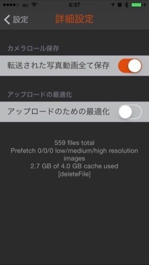
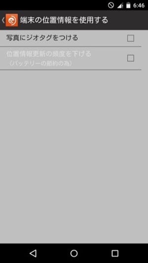

写真アプリがリリースされてから、写真は写真アプリ=iCloudフォトライブラリを使って保存しています。一方、カメラにはEye-fi mobi カードを入れています。

というわけで、Eye-fy mobi カードからiCloudフォトライブラリまでの設定方法を書いておきます。

### Eye-fiアプリから写真アプリの保存

Eye-fi mobiカードとEye-fiアプリとの設定とiCloudフォトライブラリの設定をしておきます。

Eye-fi アプリ for iOSには、詳細設定に「転送された写真動画すべて保存」というオプションがこっそりあります。

これをONにしておくと、Eye-fi mobiカードからEye-fiアプリで取り込んだ写真を”カメラロール”に保存することができます。

これだけで完了。簡単ですね。

iCloudフォトライブラリをONにすると”カメラロール”はなくなるのですが、問題なく写真アプリに保存されます。Eye-fiクラウドでも、端末間で写真を使うことができるのですが、iCloudフォトライブラリに保存された写真は、OS側で連携できるため、アプリから呼び出すことができるので便利ですね。

気をつける点としては、iCloudフォトライブラリは端末からのアップロードにWi-Fiが必須なので、たとえばiPhoneをWi-Fiのある環境に一定時間置かないとiPhoneに保存した写真をMac側で使えません。

どうしても出先で写真が必要な場合は、AirDropを使って転送してしまうのがいいと思います。もしくは、Dropboxなどのストレージサービスを使うか、Eye-fiクラウドを3G/LTE回線使って同期するよう設定するか、ですね。

### ジオタグの設定

Apertureから写真アプリに移行してなくなった機能のひとつに、ジオタグの設定・編集ができなくなったことがあります。

AndroidのEye-fiアプリにはジオタグをつける設定があります。

*   [Android アプリのジオタグ機能について](http://jp.eyefi.com/company/blog/android)

これを有効にするには、Eye-fi mobiカードからAndroidに取り込みが必要になります。すると、AndroidとiPhoneの間の同期はEye-fiクラウドになりますが、Eye-fiクラウド経由で同期された写真はiPhoneの”カメラロール”には保存してくれないようです。この移動は手動になるようなのですが、IFTTTのレシピを自動化してしまうのも便利だと思います。

というわけで、以上Eye-fiのTipsでした。