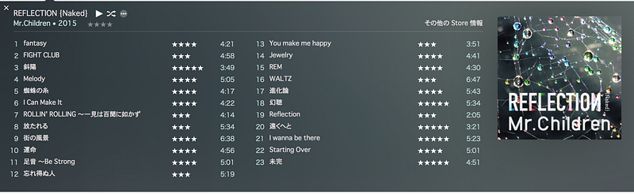

事前に出版された様々な音楽雑誌をして、”最高傑作”と言わせる。そんなアルバムが発売されました。（iTunes Storeにはこのタイミングでも登場しませんでした）

REFLECTION{Naked}

でけーよ。

比較用に使ったのは、藤岡みなみ＆ザ・モローンズのファーストミニアルバム。7月にセカンドミニアルバムも出るらしいっすよ。

というのはおいといて、箱が大きい。REFLECTION{Naked}はCDではなくUSBですよ。

というわけで、さっそく開封を。

REFLECTIONは、反射という意味ですね。サッカーではシュートがディフェンダーにあたってコースが変わるときにもよく使われます。シュートブロックしそこなって、コースが変わったシュートはキーパーも反応できない回転がかかっていたりしてとりにくいシュートになります。

というわけで、箱をあけると反射している図。

さらに箱をあけると、なんと通常販売されている REFLECTION{Drip} が入っている豪華仕様。

そして、その奥に入っているのが…

反射しているUSBメモリです。大きな箱に、丁寧におさめられています。あけるとこんな感じ。

ちなみに、USBはType-A。CDからUSBという方式を選んだ画期的な音楽パッケージを前にしてなんですが、この形式は、[Intelが「Thunderbolt 3」を発表――USB 3.1 Type-Cとの共存で延命へ (ITmedia)](http://www.itmedia.co.jp/pcuser/articles/1506/03/news054.html)なんてニュースが伝えられている今では、それほど遠くない将来なくなると思われる規格です。

これをMacBookに(アダプタ経由で)刺すと、認識してくれます。アイコンもデバイスと同じ三角。

そして、Finderはこんな感じ。

きちんとジャケ写が付いているのがにくいです。

“96kHz 24bit”というフォルダにはwaveファイルが、MP3というファイルにはmp3が保存されています。一般的にはハイレゾが聞けるデバイスは限られているので、MP3をiTunesに入れて、みたいな感じにするんでしょうね。個人的には、AACの方が好みなので、waveをiTunesに入れてエンコードしました。iTunes MatchにはAppleロスレスも対応していないので難儀ですね。

というわけで、waveを聞き始めます。waveはiTunesで管理したくないので[VLC Media Player](http://www.videolan.org/vlc/) で聞くことにします。

構成としては、MacBook(プレイヤー)→DENON DA-10(アンプ)→SONY MDR-1R(ヘッドフォン)という形。一応DA-10もMDR-1Rもハイレゾマーク付いてます。

やっぱハイレゾきれいですね。ヘッドフォンがSONYのせいもあるけど、ちゃんと音が立ってるし、なんとなく聞いているじゃなくて、ちゃんと聞いているになりますね。

さて、全23曲全再生時間1時間50分のアルバム。だいたい映画1本分。POPなミスチル、ROCKなミスチル、爽やかな風を届けてくれそうなミスチル、いろんなMr.Childrenがそこにいました。

これまでのアルバムだと、「この曲は前のアルバムのこれに似てるな」とか「この曲は前の前のアルバムの感じだな」とか感じながら聞いていたりするのですが、このアルバムは網羅している、そんな感じがします。なんと反射率の高いクリスタルなんだろう。

{Naked}を買った人はぜひ23曲を一度フルで。{Drip}の人はその世界をぜひ堪能して欲しい、そんなアルバムでした。

そしてファーストインプレッションはこんな感じになりました。聞き込んでいくうちに変わるかもね！

