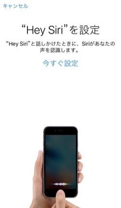

iOS9がリリースされました。

Developer向けにリリースされていたiOS9 GM Seedからも若干の変更があり、確認が終わっていたはずの開発者も場合によっては再チェックが必要になっているようです。

さて、そんなiOS9ですが、”Hey Siri”の機能に若干の変更が行われています。

設定のSiriを、OFF/ONにすると、この画面が出てきます。

iOS9でも、電源に繋がっているiPhoneに”Hey Siri”と声を掛けるとSiriが起動します。これまでは誰の声でも反応していて、たとえば、ラジオなどで”Hey Siri”というとアチコチのiPhoneが反応するという笑い話もあるようです。

iOS9からは、誰から話しかけられたかを判断して、所有者から声をかけられたと分かって初めて反応することになります。

話によると、iPhone 6s/6s plusからは、電源に繋がっていなくても反応するようになるらしいです。

Touch IDによって指紋を欲しがったiPhoneは次は声紋をほしがるようになりました。iPhoneからは外に出ないとはいえ、さまざまな生体認証情報を使うデバイスになっていきそうです。