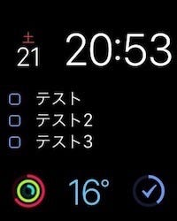

Things on Watch OS 2がリリースされました。使っていてとても気持ちがよかったです。Watch OS 2に対応したアプリは、出てきていると思いますが、使う回数の多いアプリが対応してくれると、嬉しいものではあります。

Thingsとは、タスク管理用アプリ、Mac版、iOS版、Watch OS版と、Appleのプラットフォームで動くものになっています。

Watch OS 2に対応するにあたって、文字盤にThingsの情報を置くことができるようになりました(Complications)。置くことができるのは “今日” の情報で、たとえば “モジュラー” を使っていると、中央のメイン領域だとリストがそのまま見れるように、右下のような小さなエリアだと円グラフの方式で表示されるようになっています。

デザインとしても特に奇をてらったわけではなく、Apple Design Awardをかつて受賞したアプリらしく、Apple謹製の他のモジュールともマッチしています。

文字盤の Thingsの情報をタップすると、Thingsアプリが立ち上がります。Watch OS 2対応で、ロジックがWatch側にあるので、非常にスムーズにiPhoneとデータを同期して表示してくれます。

Things for Watch OS 2では、”今日”のリストの情報しかみれませんが、あさイチで「今日やること」が決まっているのであればこれで充分。

*   参考: [日本語訳: Getting Started with Things](http://blog.qli.jp/2014/05/18/getting-started-with-things/)

ちょっと息抜きの時間に腕時計でタスクを完了にして、残りのタスクに取りかかるだけですし、帰宅中にタスクが残ってる=寄り道することを思い出す、ということもあるかもしれません。