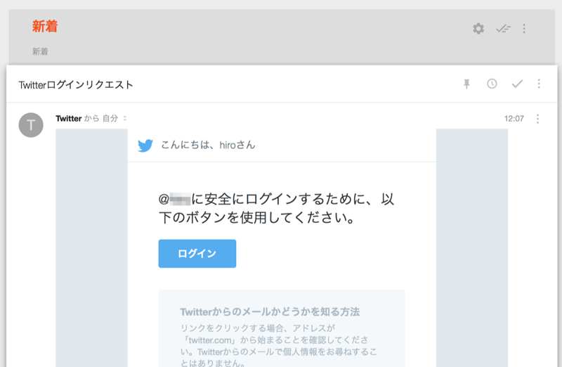
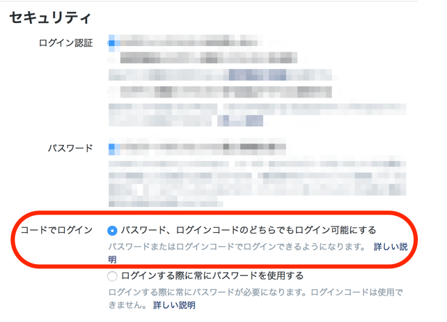
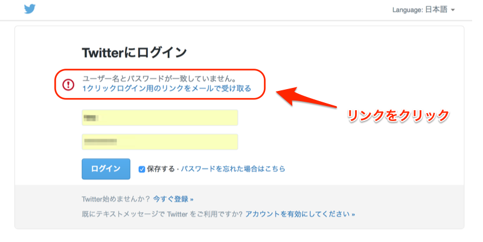

「Twitterログインリクエスト」というメールが届くようになっており、「なにこれ？」「不審なメールなの？」と感じている人も多いようなので、まとめておきます。

ちなみにこのメールの「ログイン」を押すとログインできます。が、この形式のメールは簡単にフィッシング等に使われそうなので、ご注意を。

### セキュリティ設定

このメールを受け取るには、セキュリティ設定で、「パスワード、ログインコードのどちらでもログイン可能にする」というオプションを選択しておくことが必要です。

### パスワードなしでログインしてみる

たとえばログイン画面で、Twitter IDだけを入力し、パスワードを空でログインしようとします。

すると、以下の画面が表示されます。

この **1クリックログイン用のリンク**が、最初にあげたメールの「ログイン」ボタンです。

### メリット・デメリット

これによって、パスワードを忘れてもログインできる、煩わしい”パスワードリセット”をする必要がないという利点があります。

ただし、メールにアクセスできる人はだれでもアクセスできるようになるため、Twitterではなくメールアカウントのセキュリティに委ねられることになります。

また、メールであるため中継地点でリンクが漏れた場合も上記同様ログインが可能になります。たとえばSafariでリンクをリクエストし、Google Chromeでそのリンクを踏むことでログイン可能になってしまいました。

この機能を有効にするには、充分にセキュリティを考慮して設定する必要がありそうです。

セキュリティに不安を感じる方は、Twitterアプリを使った2段階認証の利用を検討しましょう。

### リクエストしていないのに届くのはどうするか

上記の通り、Twitter IDさえ分かれば、このメールを送信することは可能です。とはいえ、自分だけがアクセスできない場所に届いている以上は気にしなくてもいいですし、不安に感じる必要はないと思われます。

ただし、このメールを不用意に転送したりしないようにしましょう。