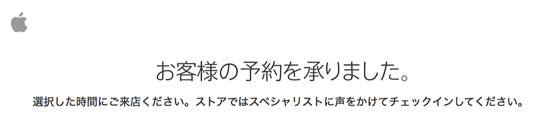

iPhone6s 128GB Space Grayを予約しました。Apple Storeのピックアップで予約したので、指定時間に受け取りに行きます。

ちなみに予約時間は16:07。記事を書いている時点で、発売日当日に受け取れる予約がまだ可能なので、予約在庫や契約用オペレーションデスクは相当な数を準備していると思われます。(もしくは”s”見送りの人が多いのかも)

今年の店頭ピックアップまでの遷移がどうなるかのアナウンスがありませんでした。16:01になりいろんな方法で試みたのですが、Apple Store iPhoneアプリからの予約が一番はやかったように思えます。(Apple Store OnlineのWEBからのアクセスは自分の環境では16:30過ぎにならないとオープンになりませんでした)

昨年のピックアップは、ストアとは違うところに入り口がありました。今回はオンラインストアにて、オンラインストアで購入する(SIMフリーのみ)とは別に、ストアで受け取れるというオプションが選択できるようになっていました。そこから別のページに飛ばされ、進んでいくと、SIMフリーかキャリア付き契約付きのiPhoneかを選択できるようになっていました。

去年も店頭ピックアップがあり、自分はそれで購入したのですが、同時に当日在庫も用意されていました。Apple Storeの店員は、いつものようにオープン直前になるまで当日店頭在庫があるかどうかをあまり明らかにしない(本当に知らないという話もあるのですが)状態で、その結果多くの人が並び、歴史に残るトラブルが生まれました。

今年は、Apple Storeの当日用店頭在庫はないと聞いています。とはいえ、当日在庫を期待した方が並ぶかもしれません。Appleとしての対応をどうするのかは気になるところです。

*   [Apple Store「iPhone 6s・iPhone 6 Plus」の店頭購入には予約が必要](http://www.macotakara.jp/blog/apple_store/entry-27942.html)