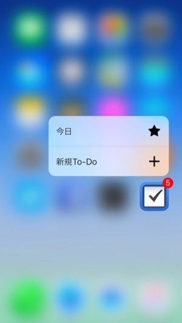

iPhone 6sの発売が6月25日に開始されました。今年の発売日に東京の天気は雨。行列にはとてもつらい天候になりましたが、今年は行列がありませんでした。

例年自分は発売日の翌日の土曜日に買いに行くことが多いのですが、今年はタイミングよく発売日の朝に買いに行きました。そのため、発売が開始される8時のタイミングのテレビでの取り上げ方を確認していないのですが、現地では客よりマスコミの方が多いという異様な状況だったことは覚えています。

客側も行列であれば徹夜明けの異様なテンションであったりするんでしょうけれども、今年はすんなり買えた感じなので、予約した時間に買い物に来ました以上の感じはありませんでした。買い物ですし、それが普通ですが。

#### 入手が難しい: 6s plus, ローズゴールド, 64GB

iPhoneが発売されるとしばらくは例年在庫状況をTwitterの状況でみていたりするんですが、今年は在庫不足感はうけないですね。いまのところ入手が難しいところでキーワードを並べるとこんな感じです。

*   ローズゴールド
*   64GBモデル
*   6s plus

iPhoneはここ数年、外部デザイン変更→内部デザイン変更を繰り返しています。今年は、内部デザイン変更にあたり、様々な部分が変更されたことが、分解で明らかになっていますが、いわゆるスペック向上の趣が強いです。

確かに使っていると、3D TouchとかLive Photoとかどうでもよくて、iPhone 6 より明らかに使いやすく、はやく、いいものに仕上がっていますが、買い換える「動機」を促すにはいまひとつなのも確か。

という状況の中で、ローズゴールドの追加によって、買い換えたいと思った人がたくさんいるということなのかもしれません。たしかにローズゴールドはとてもいい色に仕上がっています。

64GBは、日本における値段設定が10万円を超えないくらい(税別)。16GBは不安だけど、128GB…いやお値段が、という検討を多くの方がしていらっしゃるのだと思います。

6s plusの入手が難しいのは主にキャリアショップから聞こえてきます。Apple Storeでは、朝8時に当日分の店頭ピックアップの予約を開始していますが、そちらでは購入できることがあるようです。一方、キャリアショップには1台も入荷していないとか、発売日前の入荷以来入荷がないという声が聞こえてきています。

どのような経緯でそういう状態になっているかはわかりませんが、キャリアショップで予約して、ずっと待っている方はApple Storeや家電量販店等、別の手段で探してみる方がいいかもしれません。

ちなみにそれ以外であれば、潤沢に在庫があるようで、発売して今日が3日目ですが、飛び込みでiPhone 6sに機種変更するという事例もあるようです。

### iPhone 6s ファーストインプレッション

最後に簡単な感想を書いておきます。今回「機能」としては語られることの多い3D TouchとLive Photoを中心に。

#### 3D Touch

3D Touch、特にホーム画面でのショートカットは、なにができるかはアプリ任せのところが多く、あまり使える気がしません。ちなみに自分が使っているアプリでは、TwitterとThingsがすでに対応しています。

ホーム画面でのショートカットは、そのアプリの特性をよく表すような「よく使われる機能」に絞って表示してくれると気持ちいいかもと思っています。

#### Live Photo

Live Photoをとってあとでみるくらいであればとても面白い機能だと思います。スクエアで撮れないのがとても残念に感じました。

うまくきっかけがつかめれば流行りそうだなと思いましたが、そのためには、Twitter / Facebook / instagram がサポートしてくれるかどうかにかかっています。

#### 全体

まだ使って時間も経っていないので充分に検証していないのですが、音がよくなったという話もあります。確かに音場が拡がった印象は受けています。

全体的にすこぶるはやいので、_これが本当のiPhone 6なんだ_感はとても強いです。Touch IDもはやくなり、スリープからの復帰もはやくなったので、全体として、ポケットから出す動作をするときにロック画面を見かけることが少なくなりました。

最後に。AppleさんはすでにiPhone 6sのCMを準備したみたいですよ。Perfumeが出てます。