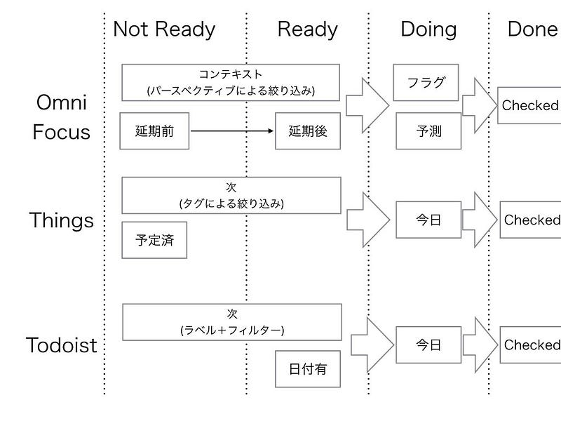

Todoistを使っていて、日付の設定が１つしかないことが気になっている。そこで、改めてタスクに必要とされることを考えてみた。

### タスクが持つ４つの状態

タスクには、最低限4つの状態が存在する。

*   not Ready : 着手できない、もしくは着手しないと決めている
*   Ready : 着手できる
*   Doing : 着手中 、もしくは今日これから着手するタスク
*   Done : 完了した

ソフトウェア開発のようなチームでこなすタスクでも、個人で行うタスクであっても、ベースとなるのはこの４つだと考えている。  
Kanbanのように、タスクを付箋に書いて管理する方法でも、上記4つがあれば使い始められる。

GTDでは自分の置かれている状況によって、確認すべきアクションリストが変わる。それはつまり、”not Ready”リストと”Ready”リストのそれぞれに表示されるタスクが、コンテキスト（その瞬間の状況）によって変化することを意味する。  
例えば、「MacBookを操作できる時のタスクリスト」に入っているタスクは、MacBookを持っていない時には”not Ready”で、MacBookを持っている時には”Ready”になる。例えば、「次のWeekly Reviewまではやらない」と決めたタスクは、次のWeekly Reviewまで”not Ready”のままになる。

タスクの状態が、”not Ready”と”Ready”のどちらになるかは、状況によって自動的に変化する。しかし、一度”Doing”してしまったタスクは、タスクを中止して”Ready”にするか、”Done”にする(完了してしまう)のどちらかにするしかない。  
さらに、”Done”にしてしまったタスクが”Doing”や”not Ready”や”Ready”に変わることはほぼない。(それをやるくらいなら新しく似たようなタスクを作ろう)

どのタスクに着手するかどうかは”Ready”のタスクの中から選ぶことになる。選ぶ基準は、プライオリティと期限とその他の条件がある。(プライオリティと期限によって選ぶ方法は、“時間管理マトリクス” に詳しい。“時間管理マトリクス” とは、重要度と緊急度の2軸でタスクを分類し、優先順位を決める方法のことだ。”アイゼンハワーマトリクス”とも呼ばれる)

### ツールごとに見ていくと

ここでタスク管理ツールごとにそれを見ていくことにする。

#### OmniFocus

OmniFocusではタスクを次のように管理する

**not Ready, Ready**   
“not Ready”の状態のタスクは以下のようなものがある。

*   入っているプロジェクトが「保留中」である
*   順次作業のグループに入っていて、前のタスクが完了していない
*   「延期」という名前の日付項目が未来の日付である
*   ついているタグの設定が「保留中」である

これらをリストにするにはパースペクティブ機能を使う。

**Doing  
**着手中を明示的に管理する方法はない。なので、タスクをすぐ終わるサイズにしておき、「終わったらチェック」を習慣づけておくことで、進捗が見えるようになる。

今日着手する予定のタスクは、”予測タグ”を使って管理することができる。例えば”Ready”のタスクの中から、着手したいものにタグをつけ、”予測”画面に表示させることができる。カスタムパースペクティブを使って予測タグがついたタスクリストを作ることもできる。

期限を迎えたタスクや期限となったタスクは、”予測”に表示される。  
時間管理マトリクスを参考にすれば、期限が近いタスクを完了させた後、”予測タグ”に着手するということになりそうだ。

**Done**  
チェックボックスにチェックすることで管理する。完了したタスクは、パースペクティブを使って確認することができる他、「プロジェクト」の機能で「すべてのタスクを表示させる」ようにすることで確認することもできる。

#### Things

Things ではタスクを次のように管理する。

**not Ready, Ready**  
“Ready”状態のタスクは「いつでも」に表示されている。また、タグによる絞り込みを使うこともできる。「いつか」には”not Ready”状態のタスクが表示されている。

**Doing**  
「今日」で管理する。  
“Ready”のタスクの中から着手したいタスクにスターを付けることで、「今日」にタスクを表示させることができる。またあらかじめ着手日を”予定”しておくことで、自動的に「今日」に表示させることが可能。  
設定した期限を迎えたタスクや、期限を超えたタスクは自動的に「今日」に表示される。タスクへの取り組みは、「今日」のタスクを完了させていくことになる。

**Done**  
チェックボックスにチェックすることで管理する。「ログブック」で、完了したタスクを見ることができる。

#### Todoist

Todoist ではタスクを次のように管理する。

**not Ready, Ready**  
フィルターによる絞り込み機能によって、”Ready”のタスクを表示することができる。  
ツールとしての管理方法はないが、例えば “[@later](http://twitter.com/later "Twitter profile for @later")” というラベルを使用し、”Ready”タスクを表示するフィルターで除外するように指定することで、”not Ready”を固定することが可能。

**Doing**  
「今日」で管理する。  
“Ready”のタスクの中から着手したいタスクを選び、日付を今日にすることで「今日」リストに追加できる。  
またあらかじめ日付を設定しておいたタスクは、「今日」に自動的に追加される。  
期限は特に記載するところがないので、タスク名やメモ欄にでも書いておくことになる。

**Done**  
チェックボックスにチェックすることで管理。「完了済み」でプロジェクトごとに完了したタスクを表示可能。

### まとめ

タスク管理の基本は、4つの状態（not Ready, Ready, Doing, Done）を意識することだ。タスクが増えると、“今着手する” タスクを選ぶのが難しくなる。その際、重要度と期限を基準にタスクを整理する「時間管理マトリクス」を活用すると、スムーズに選択できる。

Todoistではプロプランに入ることで「期限」が使えるようになる。もし、無料版で使う場合は、明示的に期限を書いておく場所がないため、「時間管理マトリクス」を使うにはひと工夫が必要になる。

（2025/03/07 全面改訂）

