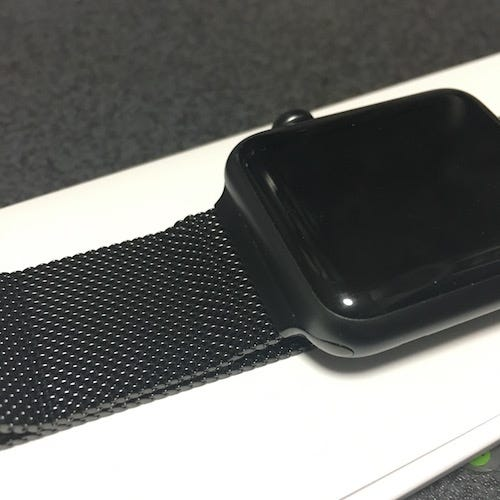

3/21のAppleのイベント “Let Us Loop You In” で発表された中で個人的に注目だったものの一つが、黒いミラネーゼループ。

黒いミラネーゼループは、実はちょっとしたトラブルで存在が明らかになったりしたものの、なかなか登場しませんでした。

*   [9to5mac: Apple leaks unreleased Space Black Milanese Loop Apple Watch band on Czech store site \[Update: Gone!\]](http://9to5mac.com/2016/01/06/apple-watch-leak-space-black-milanese-loop-new-band/)

イベントの中で発表されたApple Watchのバンドで特に注目されたのは、ウーブンナイロン。ところがその中でこっそり紹介されたいのが、スペースブラックミラネーゼループでした。

というわけで、早速Apple Watch Sports スペースグレイに装着。

普段スーツを着たりしないのですが、スポーツバンドよりはフォーマルに近い感じがあります。

今回新しいバンドが出たことで、Apple Watchのラインナップも少し変更されています。それに合わせてか Apple Watchの商品ページも更新されています。その中では「通知/フィットネス/健康/パーソナライズ」がポイントとしてあげられていました。