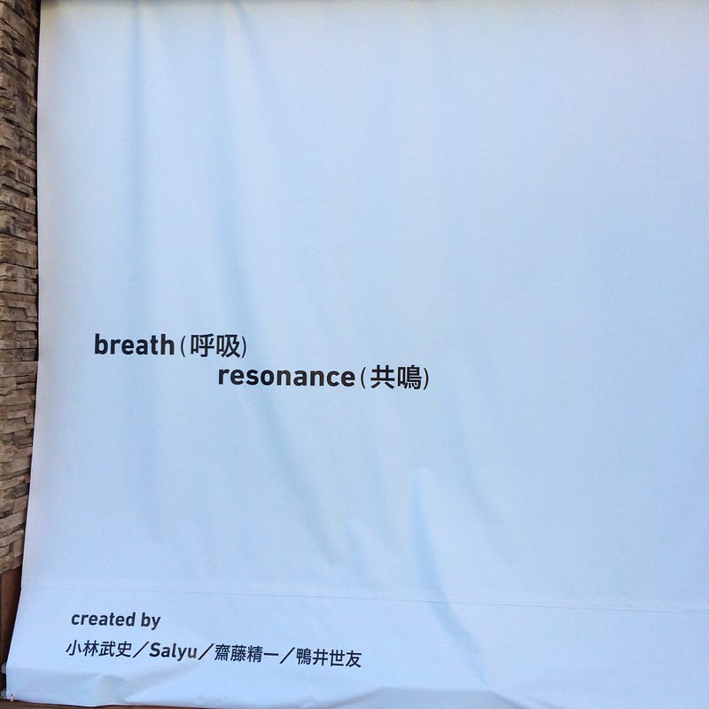

Yen Town Bandは、1995年初めてのアルバム"MONTAGE"をリリースした。それは映画「スワロウテイル」で出てくる通り、まさに西洋なのか東洋なのかわからない、もはやボーダレスな 3rd Culture Musicだった。

Yen Town Bandは、2016年2枚目のアルバム"diverse journey"をリリースした。西洋か東洋かではなく、明らかに東洋の、むしろ日本を力強く奏でるサウンドに聞こえる。

それは、2014年夏石巻(STAND UP WEEK)、2015年夏新潟(大地の芸術祭)、2016年夏石巻(Reborn Art Fes ap bank fes 2016)、2017年石巻(Reborn Art Fes)を通じたプロジェクトを奏でる、日本を強く奏でるサウンド。そこに、東京メトロCM曲のmy townが加わることで、都と地方を巻き込んだ、強いサウンドになりつつある。

